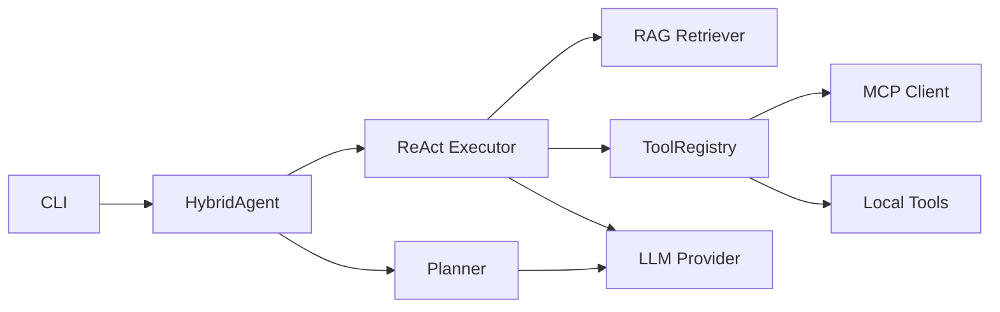

<div align="center">
  <a href="README.md"></a>
  <a href="README.zh.md"></a>
</div>

# RAGent

<div align="center">
  <a href="https://github.com/soyoshio/RAGent/actions/workflows/ci.yml"></a>
  <a href="LICENSE"></a>
  <a href=".python-version"></a>
  <a href="src/ragents/__init__.py"></a>
</div>

**RAGent** is a RAG-powered intelligent agent designed for code knowledge base Q&A. It combines Plan-and-Execute with ReAct paradigms and supports dynamic tool ecosystem expansion via the MCP protocol.

## Features

- **Multi-way Retrieval** — Vector (semantic) + Keyword (BM25) + Graph (relational) with reciprocal rank fusion
- **Hybrid Agent** — Planner generates task plans; Executor runs ReAct loops
- **MCP Protocol** — Dynamically discover and invoke external Tool Servers
- **Progressive Skill Disclosure** — Automatically adjust capability level based on task complexity
- **CLI Interface** — Supports both direct queries and interactive chat modes

## Quick Start

```bash
# Install dependencies
pip install ragents

# Configure environment
cp .env.example .env
# Edit .env with your API keys

# Direct query
ragent query "How do React Hooks work?"

# Interactive chat
ragent chat

# Build index
ragent index ./my_docs/ --output ./index/my_docs
```

## Architecture Overview



## Documentation

- [Interface Contracts](docs/en/interface_contract.md) — API specifications for all base classes
- [Data Models](docs/en/data_model.md) — Pydantic schema definitions
- [Architecture](docs/en/architecture.md) — System design and data flows
- [Development Guide](docs/en/development_guide.md) — Contributing and extending
- [MCP Setup](docs/en/mcp_setup.md) — MCP Server configuration

## Project Structure

```
RAGent/
├── src/ragents/       # Main package
│   ├── cli/           # Command-line interface
│   ├── agent/         # Agent core (Planner + Executor)
│   ├── rag/           # Retrieval layer
│   ├── mcp/           # MCP protocol client
│   ├── tools/         # Local tool implementations
│   ├── llm/           # LLM abstraction
│   ├── schema/        # Pydantic data models
│   └── utils/         # Utilities
├── tests/             # Unit, integration, and benchmark tests
├── docs/              # Documentation (en / zh)
├── scripts/           # Development and deployment scripts
└── examples/          # Sample input documents
```

## Development

See [Development Guide](docs/en/development_guide.md) for setup instructions and contribution guidelines.

## License

[MIT](LICENSE)
