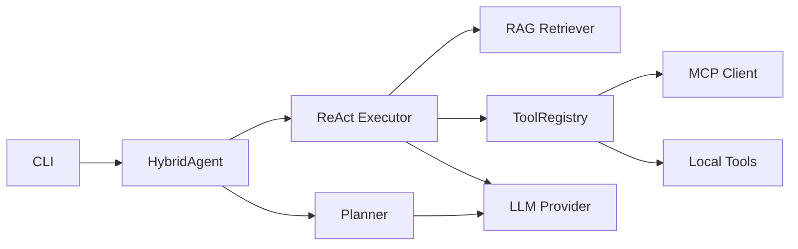

<div align="center">
  <a href="README.md"></a>
  <a href="README.zh.md"></a>
</div>

# RAGent

<div align="center">
  <a href="https://github.com/soyoshio/RAGent/actions/workflows/ci.yml"></a>
  <a href="LICENSE"></a>
  <a href=".python-version"></a>
  <a href="src/ragents/__init__.py"></a>
</div>

**RAGent** 是一个基于 RAG（检索增强生成）的智能 Agent，专为代码知识库问答设计。它结合 Plan-and-Execute 与 ReAct 范式，支持 MCP 协议动态扩展工具能力。

## 特性

- **多路召回检索** — 向量（语义）+ 关键词（BM25）+ 图谱（关系），基于倒数排名融合
- **混合 Agent** — Planner 生成任务计划，Executor 通过 ReAct 循环执行
- **MCP 协议支持** — 动态发现与调用外部 Tool Server
- **渐进式 Skill 披露** — 根据任务复杂度自动调整能力层级
- **CLI 交互** — 支持直接查询与交互式聊天两种模式

## 快速开始

```bash
# 安装依赖
pip install ragents

# 配置环境变量
cp .env.example .env
# 编辑 .env 填入 API Key

# 直接查询
ragent query "How do React Hooks work?"

# 交互式聊天
ragent chat

# 构建索引
ragent index ./my_docs/ --output ./index/my_docs
```

## 架构概览



## 文档

- [接口契约](docs/zh/interface_contract.md) — 所有基类的 API 规范
- [数据模型](docs/zh/data_model.md) — Pydantic 模式定义
- [架构设计](docs/zh/architecture.md) — 系统设计与数据流
- [开发指南](docs/zh/development_guide.md) — 贡献与扩展
- [MCP 配置](docs/zh/mcp_setup.md) — MCP Server 配置指南

## 项目结构

```
RAGent/
├── src/ragents/       # 主包
│   ├── cli/           # 命令行界面
│   ├── agent/         # Agent 核心（Planner + Executor）
│   ├── rag/           # 检索层
│   ├── mcp/           # MCP 协议客户端
│   ├── tools/         # 本地工具实现
│   ├── llm/           # 大模型抽象层
│   ├── schema/        # Pydantic 数据模型
│   └── utils/         # 通用工具
├── tests/             # 单元、集成、基准测试
├── docs/              # 文档（en / zh）
├── scripts/           # 开发与部署脚本
└── examples/          # 示例输入文档
```

## 开发

参见 [开发指南](docs/zh/development_guide.md) 了解环境搭建与贡献指南。

## License

[MIT](LICENSE)
