# Architecture Design

> **Version:** 0.1.0
> **Last Updated:** 2026-05-19

---

## 1. System Overview

RAGent is a **hybrid RAG-Agent** system combining:
- **Plan-and-Execute** for complex multi-step tasks
- **ReAct** (Reasoning + Acting) for tool-augmented execution
- **Multi-way Retrieval** (vector + keyword + graph) for grounding
- **MCP Protocol** for dynamic tool ecosystem integration

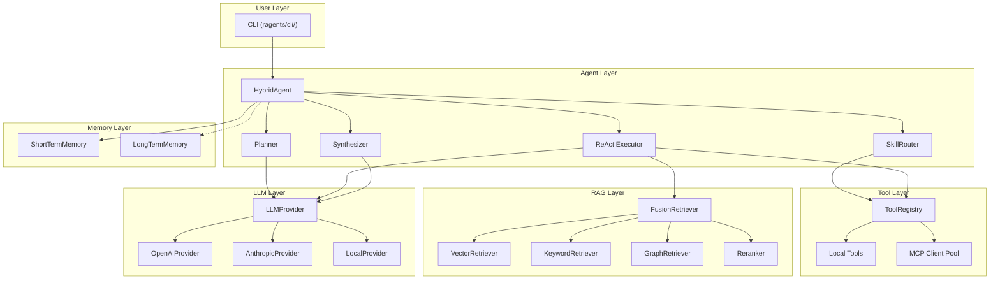

---

## 2. Layer Responsibilities

### 2.1 CLI Layer

**Responsibilities:**
- Parse user input (commands, flags, queries)
- Render output (Markdown, tables, progress bars via `rich`)
- Handle top-level error boundaries (catch-all exception handler)
- Load configuration and environment

**Entry Points:**
| Command | Module | Agent Mode | Memory |
|---------|--------|-----------|--------|
| `ragent "..."` | `commands/query.py` | One-shot, no history | Stateless |
| `ragent chat` | `commands/chat.py` | Interactive | ShortTermMemory |
| `ragent index` | `commands/index.py` | No agent | — |
| `ragent mcp` | `commands/mcp.py` | Management | — |

---

### 2.2 Agent Layer

The Agent layer is the **orchestration core**. It decides *whether* to plan, *which* tools to use, and *how* to synthesize the final answer.

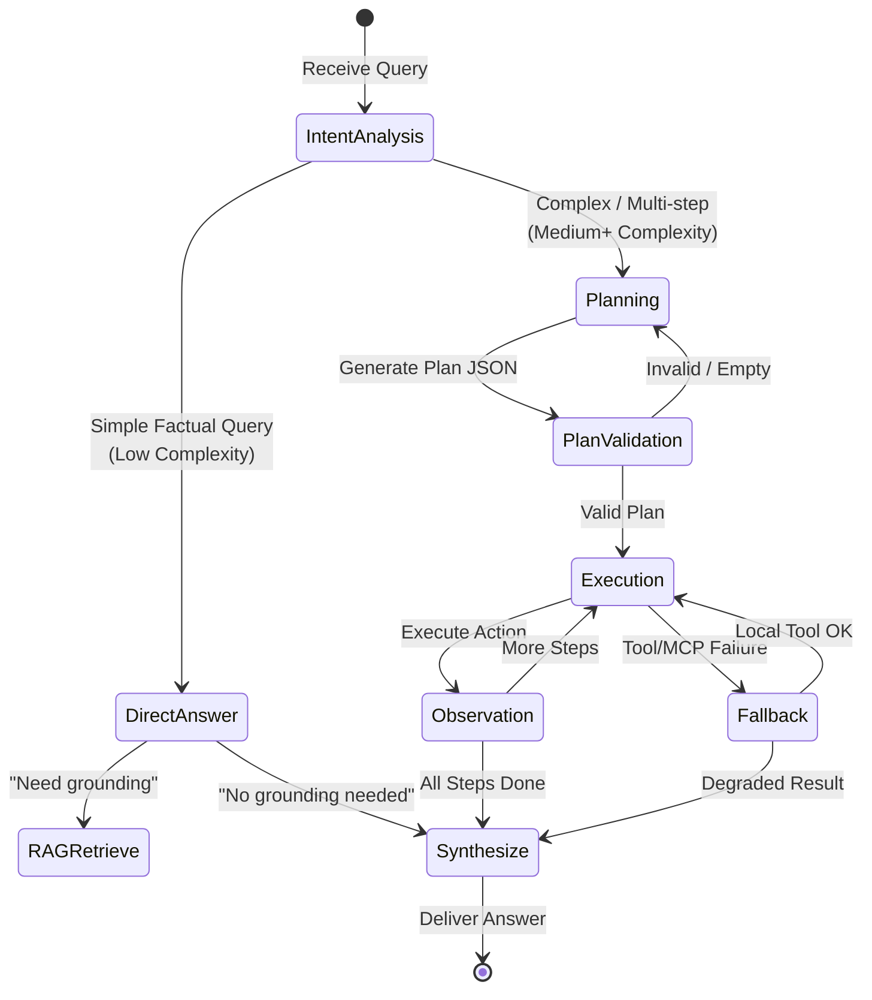

#### HybridAgent Decision Flow

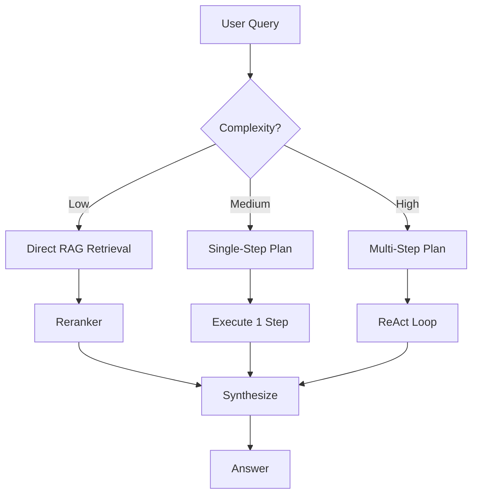

| Complexity | Heuristic | Planner Action | Max Steps |
|-----------|-----------|---------------|-----------|
| Low | Single entity, no comparison | Skip planner; direct RAG | 0 |
| Medium | Comparison, cause-effect | Generate 1-3 step plan | 3 |
| High | Multi-document synthesis, code generation | Generate full ReAct plan | 10 |

---

### 2.3 RAG Layer

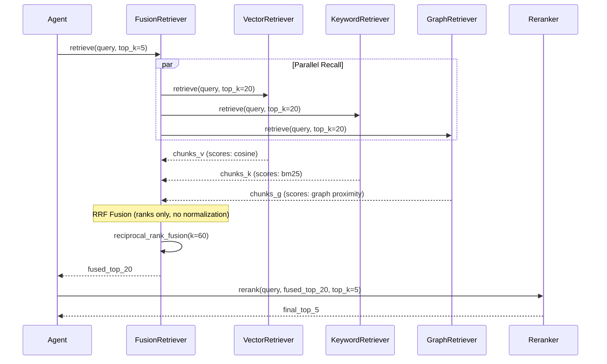

#### Reciprocal Rank Fusion Formula

```
RRF_score(d) = Σ 1 / (k + rank_r(d))
```

Where:
- `k = 60` (constant, prevents domination by top ranks)
- `rank_r(d)` = rank of document `d` in retriever `r`
- Documents not ranked by a retriever receive `rank = ∞` (contribution = 0)

**Important:** RRF operates on **ranks**, not scores. No Min-Max normalization is needed before fusion.

---

### 2.4 Tool Layer

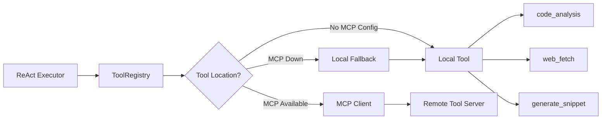

**Progressive Disclosure:**

| Skill Level | Tools Exposed | Example Query |
|------------|---------------|---------------|
| Basic | `doc_summary`, `query` | "What is useState?" |
| Intermediate | + `code_analysis`, `cross_reference` | "Compare useState and useReducer" |
| Advanced | + `generate_snippet`, `web_fetch`, MCP tools | "Build me a custom hook for data fetching and verify against React docs" |

---

### 2.5 MCP Layer

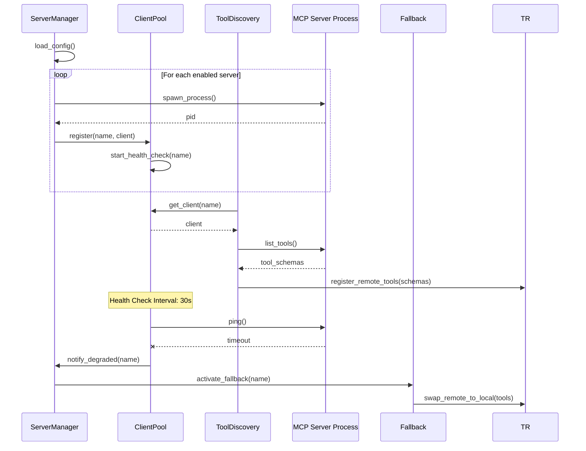

**Lifecycle States:**

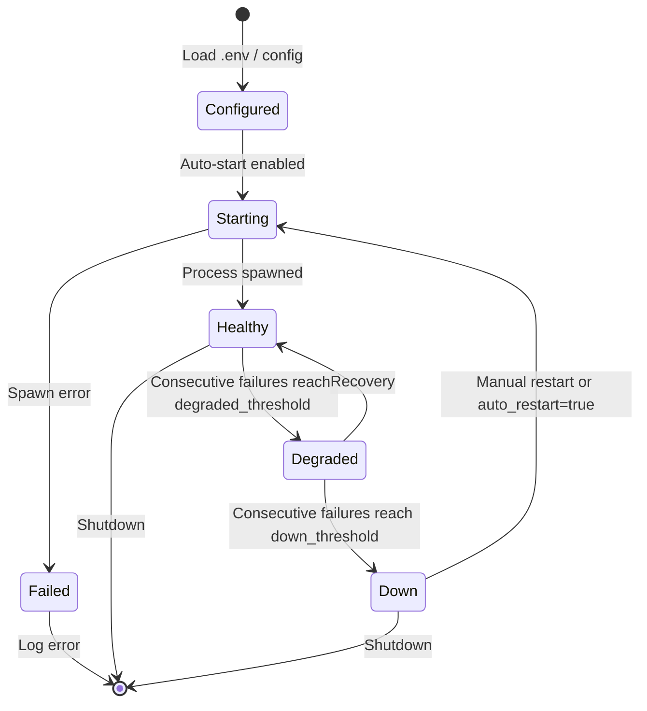

---

### 2.6 LLM Layer

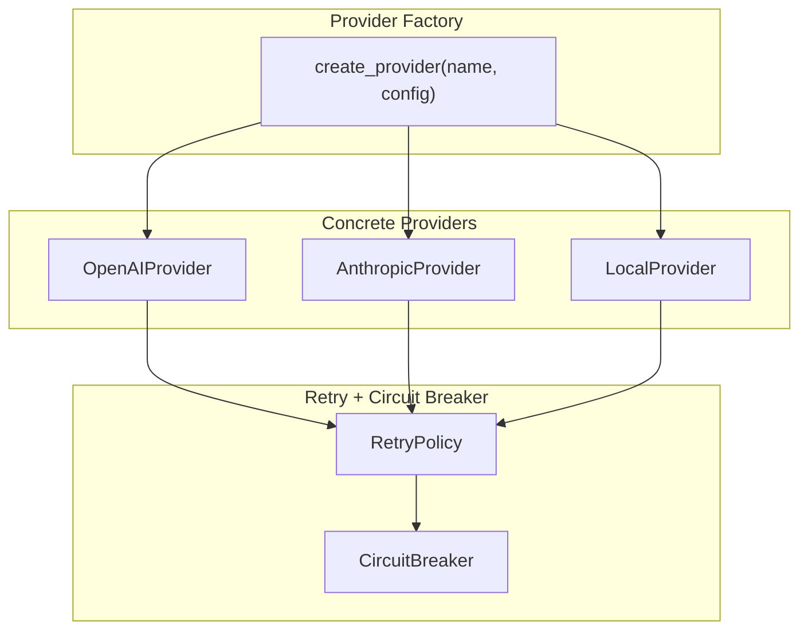

**Provider Selection Logic:**

```python
# Pseudocode
def select_provider(task_type, complexity):
    if task_type == "planning" and complexity == "high":
        return create_provider(settings.llm.planning_provider)
    elif task_type == "embed":
        return create_provider(settings.llm.embed_provider)
    elif task_type == "chat" and not internet:
        return create_provider(settings.llm.local_provider)
    else:
        return create_provider(settings.llm.default_provider)
```

---

### 2.7 Memory Layer

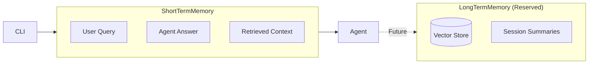

**ShortTermMemory Design:**
- Ring buffer of last N turns (default: 10)
- Stores raw messages + retrieved context IDs
- Automatically injected into `Planner` and `Executor` context

**LongTermMemory (Reserved for v0.2):**
- Cross-session vector memory for recurring topics
- Automatic conversation summarization
- User preference learning

---

## 3. Data Flow Diagrams

### 3.1 Query Flow (Direct)

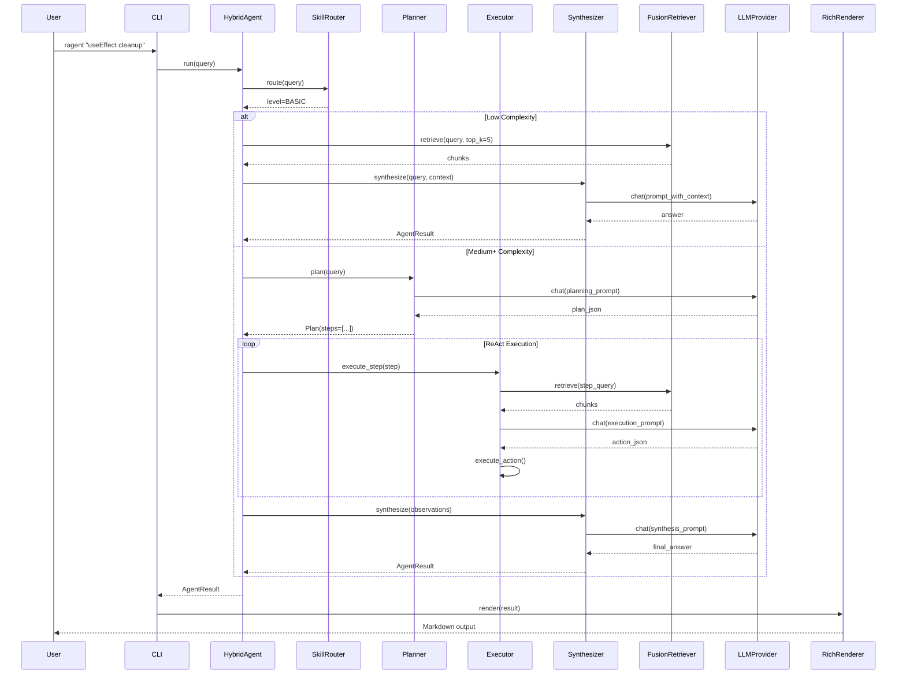

### 3.2 Index Flow

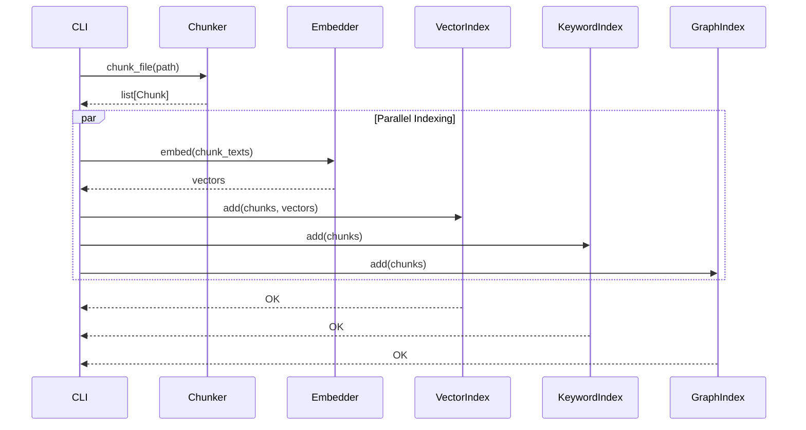

### 3.3 Chat Flow (Interactive)

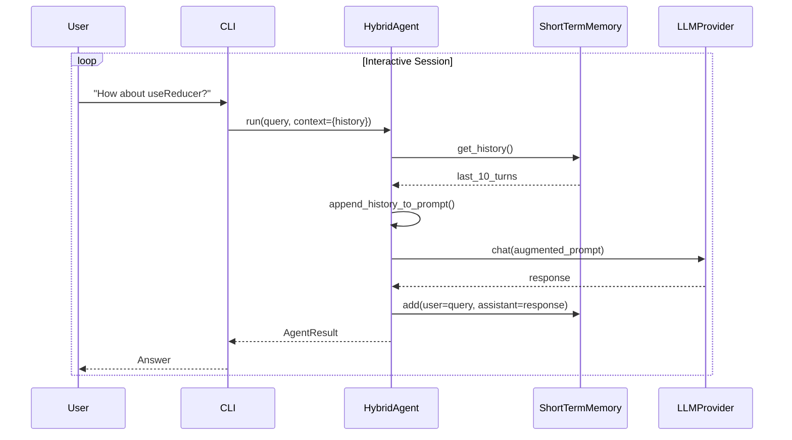

---

## 4. Component Interaction Matrix

| Caller → Callee | LLMProvider | ToolRegistry | FusionRetriever | Chunker | Embedder | MCP Client | Memory |
|----------------|-------------|--------------|-----------------|---------|----------|------------|--------|
| **CLI** | — | — | — | — | — | — | — |
| **HybridAgent** | — | — | — | — | — | — | get, add |
| **Planner** | chat | — | — | — | — | — | get |
| **Executor** | chat | call | retrieve | — | — | — | — |
| **Synthesizer** | chat | — | — | — | — | — | — |
| **FusionRetriever** | — | — | — | — | — | — | — |
| **Chunker** | — | — | — | — | — | — | — |
| **MCP Client** | — | — | — | — | — | — | — |

**Design Principle:** HybridAgent does **not** directly call LLMProvider, ToolRegistry, or FusionRetriever. All interactions go through Planner, Executor, or Synthesizer.

---

## 5. Configuration Architecture

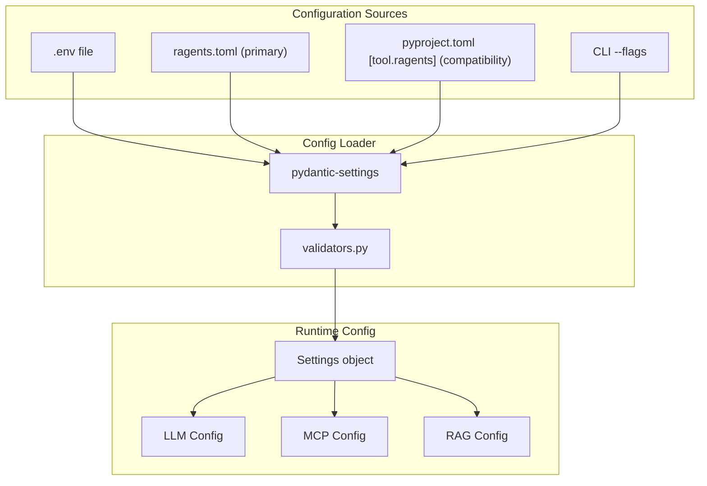

**Priority (highest to lowest):**
1. CLI arguments (`--model`, `--index`)
2. Environment variables (`OPENAI_API_KEY`)
3. `.env` file
4. `ragents.toml` (primary project config)
5. `pyproject.toml [tool.ragents]` (compatibility fallback)
6. Default values in `Settings` model

---

## 6. Scalability Considerations

### 6.1 Horizontal Scaling (Future)

| Component | Scaling Strategy |
|-----------|-----------------|
| LLMProvider | Load balancing across multiple API keys; local model replicas via vLLM |
| MCP Client | Connection pooling; health-check-based routing |
| FusionRetriever | Shard by document collection; parallel retriever processes |
| Embedder | Batch processing; GPU offloading for local models |

### 6.2 Caching Strategy

| Layer | Cache Target | TTL | Invalidation |
|-------|-------------|-----|--------------|
| LLM | Chat completions (exact match) | 1 hour | Manual / API key change |
| RAG | Embedding vectors | Infinite | Document re-index |
| Tool | Web fetch results | 5 minutes | Manual |
| MCP | Tool schemas | Until disconnect | Server restart |

---

## 7. Technology Stack

| Layer | Primary Libraries | Alternatives |
|-------|-------------------|--------------|
| CLI | `argparse` + `rich` | `typer`, `click` |
| Schema | `pydantic` v2 | — |
| Config | `pydantic-settings` | `python-dotenv` |
| Logging | `structlog` | Standard `logging` |
| LLM | `openai`, `anthropic` SDKs | `litellm` (future) |
| RAG (Vector) | `numpy` + custom HNSW | `faiss`, `chromadb` |
| RAG (Keyword) | `rank-bm25` | `whoosh` |
| RAG (Graph) | `networkx` | `neo4j` |
| MCP | `mcp` SDK (official) | Custom stdio/SSE |
| Testing | `pytest` | — |
| Packaging | `hatchling` + `uv` | `poetry`, `pdm` |

---

## 8. Version Boundaries

| Version | Scope | Key Changes |
|---------|-------|-------------|
| 0.1.x | MVP | Synchronous first; local tools + MCP; ShortTermMemory only |
| 0.2.x | Extension | Async first-class; LongTermMemory; frozen index structures |
| 0.3.x | Scale | Distributed retrievers; multi-model ensemble; web UI |

---

## Appendix: File Organization Rationale

**Why `src/ragents/` instead of `ragents/` at root?**

The `src-layout` (placing source under `src/`) prevents accidental imports of the development directory. It ensures that:
1. Tests run against the **installed** package, not the source tree
2. `import ragents` fails unless the package is properly installed
3. Build artifacts are cleanly separated from source
