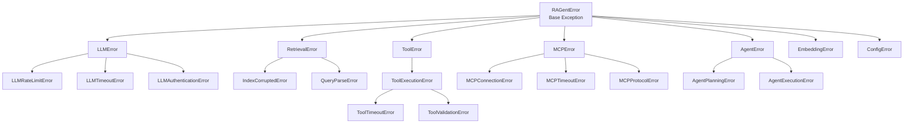
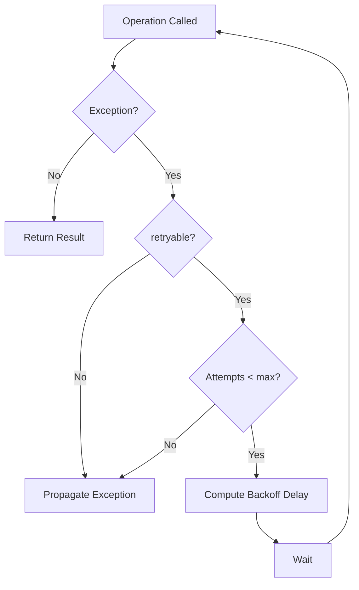
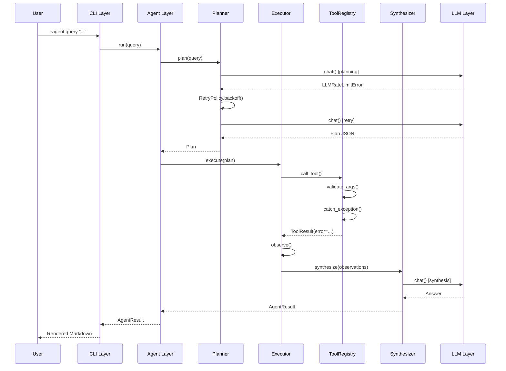

# Error Handling Strategy

> **Strategy:** Option A — Hierarchical Exception Hierarchy
> **Philosophy:** Fail fast at boundaries, retry where appropriate, degrade gracefully at the CLI.

---

## 1. Exception Hierarchy



---

## 2. Base Exception Class

```python
class RAGentError(Exception):
    """Base exception for all RAGent errors.

    Attributes:
        error_code: Machine-readable error code (e.g., "LLM_RATE_LIMIT").
        message: Human-readable description.
        retryable: Whether the operation can be retried.
        context: Additional key-value context for logging.
    """

    error_code: str = "UNKNOWN"
    retryable: bool = False

    def __init__(self, message: str, *, context: dict | None = None):
        super().__init__(message)
        self.message = message
        self.context = context or {}
```

### 2.1 Error Code Convention

Format: `{LAYER}_{CAUSE}`

| Prefix | Layer | Examples |
|--------|-------|----------|
| `LLM_*` | LLM Provider | `LLM_RATE_LIMIT`, `LLM_TIMEOUT`, `LLM_AUTH`, `LLM_CONTENT_FILTER` |
| `RETRIEVAL_*` | RAG / Retrieval | `RETRIEVAL_INDEX_CORRUPTED`, `RETRIEVAL_QUERY_PARSE` |
| `TOOL_*` | Local Tools | `TOOL_EXECUTION`, `TOOL_TIMEOUT`, `TOOL_VALIDATION` |
| `MCP_*` | MCP Protocol | `MCP_CONNECTION`, `MCP_TIMEOUT`, `MCP_TOOL_NOT_FOUND` |
| `AGENT_*` | Agent Core | `AGENT_PLANNING`, `AGENT_EXECUTION`, `AGENT_MAX_STEPS` |
| `EMBED_*` | Embedder | `EMBED_MODEL_NOT_LOADED`, `EMBED_BATCH_TOO_LARGE` |
| `CONFIG_*` | Configuration | `CONFIG_MISSING_KEY`, `CONFIG_PARSE_ERROR` |

---

## 3. Layer-Specific Exception Definitions

### 3.1 LLMError Family

| Exception | `retryable` | Trigger Condition | Retry Strategy |
|-----------|-------------|-------------------|----------------|
| `LLMRateLimitError` | `True` | HTTP 429, `x-ratelimit-remaining: 0` | Exponential backoff: `base * (2 ** attempt)` |
| `LLMTimeoutError` | `True` | Socket timeout, read timeout | Retry with same delay + jitter |
| `LLMAuthenticationError` | `False` | HTTP 401/403, invalid key | Immediate fail; log security event |
| `LLMContentFilterError` | `False` | Content policy violation | Immediate fail; suggest rephrasing |
| `LLMError` | `False` | Generic / unclassified | Immediate fail |

### 3.2 RetrievalError Family

| Exception | `retryable` | Trigger Condition |
|-----------|-------------|-------------------|
| `IndexCorruptedError` | `False` | Checksum mismatch, unreadable index file |
| `QueryParseError` | `False` | Malformed query syntax (e.g., graph query) |
| `RetrievalError` | `False` | Generic storage error |

### 3.3 ToolError Family

| Exception | `retryable` | Trigger Condition |
|-----------|-------------|-------------------|
| `ToolExecutionError` | Depends on tool | Runtime failure (e.g., network, file not found) |
| `ToolTimeoutError` | `True` | Exceeded declared `timeout` |
| `ToolValidationError` | `False` | Arguments failed JSON Schema validation |

**Tool Retry Policy:**  
Each tool declares its own `max_retries` and `retryable_exceptions` in the registry. Default: `max_retries=0` for side-effect-heavy tools (e.g., `web_fetch` may retry; `generate_snippet` does not).

### 3.4 MCPError Family

| Exception | `retryable` | Trigger Condition | Fallback Action |
|-----------|-------------|-------------------|-----------------|
| `MCPConnectionError` | `True` (3 attempts) | Stdio pipe broken, SSE disconnect | Switch to local fallback tools |
| `MCPTimeoutError` | `True` (1 attempt) | Tool call exceeded server timeout | Switch to local fallback tools |
| `MCPProtocolError` | `False` | Protocol version mismatch or invalid message format | Log mismatch; skip this tool |

### 3.5 AgentError Family

| Exception | `retryable` | Trigger Condition |
|-----------|-------------|-------------------|
| `AgentPlanningError` | `True` (1 attempt with different temperature) | Planner produced invalid JSON or empty plan |
| `AgentExecutionError` | `False` | Max steps exceeded, or critical tool chain failure |
| `AgentMaxStepsError` | `False` | Executor hit `max_steps` limit (default: 10) |

---

## 4. Retry Policy Specification



### 4.1 Exponential Backoff Formula

```
delay = min(base * (2 ** attempt) + random jitter, max_delay)
```

| Parameter | Default Value | Description |
|-----------|---------------|-------------|
| `base` | `1.0` second | Initial delay. |
| `max_attempts` | Layer-dependent | LLM: 3, MCP: 3, Tool: 0-2 (per-tool config) |
| `max_delay` | `60.0` seconds | Hard cap to prevent excessive waiting. |
| `jitter` | `random.uniform(0, 1)` | Prevents thundering herd. |

### 4.2 Circuit Breaker Integration

The `RetryPolicy` collaborates with a `CircuitBreaker`:

- **Closed state:** Normal operation; failures increment counter.
- **Open state:** After `failure_threshold` consecutive failures, reject fast for `recovery_timeout` seconds.
- **Half-open state:** After timeout, allow one probe request. Success → closed; failure → open.

---

## 5. Error Propagation Path



### 5.1 Boundary Handling Rules

| Boundary | Action on Exception |
|----------|-------------------|
| **LLM → Agent** | Retry if `retryable`; otherwise wrap in `AgentExecutionError` with context. |
| **Tool → Agent** | `ToolRegistry.call()` catches exceptions and converts to `ToolResult(error=...)`. If fallback tools are configured, try them. |
| **MCP → Agent** | Always degrade to local fallback; mark server `DEGRADED`. |
| **Agent → CLI** | Never propagate raw exceptions. Convert to user-friendly message with `--verbose` option for stack trace. |

---

## 6. CLI Error Rendering

### 6.1 Default Mode (User-Facing)

```
Request failed: Rate limit exceeded. Please wait a moment and try again.
   (Error code: LLM_RATE_LIMIT)
```

### 6.2 Verbose Mode (`--verbose` / `-v`)

```
LLMRateLimitError: Rate limit exceeded
   Code: LLM_RATE_LIMIT
   Retryable: True
   Attempts: 3/3
   Provider: openai
   Context: {"model": "gpt-4o-mini", "retry_after": 20}
   Traceback:
     File "src/ragents/llm/openai_provider.py", line 42, in chat
       ...
```

### 6.3 JSON Mode (`--json`)

```json
{
  "success": false,
  "error": {
    "code": "LLM_RATE_LIMIT",
    "message": "Rate limit exceeded",
    "retryable": true,
    "context": {"retry_after": 20}
  }
}
```

---

## 7. Structured Logging Integration

Every exception is logged via `structlog` with the following fields:

```python
{
    "event": "operation_failed",
    "error_code": "LLM_RATE_LIMIT",
    "error_type": "LLMRateLimitError",
    "retryable": True,
    "attempt": 2,
    "max_attempts": 3,
    "latency_ms": 1250.0,
    "layer": "llm",
    "provider": "openai",
    "context": {"model": "gpt-4o-mini"}
}
```

This enables downstream alerting and debugging without parsing stack traces.

---

## 8. Decision Matrix

| Scenario | Exception | Retry? | Fallback? | User Message |
|----------|-----------|--------|-----------|--------------|
| OpenAI 429 | `LLMRateLimitError` | Yes (3x) | No | "Rate limited. Retrying..." |
| OpenAI 401 | `LLMAuthenticationError` | No | No | "Invalid API key. Check .env" |
| MCP server down | `MCPConnectionError` | Yes (3x) | Yes (local tools) | "MCP unavailable. Using local tools." |
| Tool timeout | `ToolTimeoutError` | Yes (1x) | Yes (if configured) | "Tool slow. Trying alternative..." |
| Planner fails | `AgentPlanningError` | Yes (1x, higher temp) | No | "Planning failed. Retrying..." |
| Max steps reached | `AgentMaxStepsError` | No | No | "Query too complex. Try breaking it down." |
| Index corrupted | `IndexCorruptedError` | No | No | "Index corrupted. Run `ragent index` to rebuild." |
