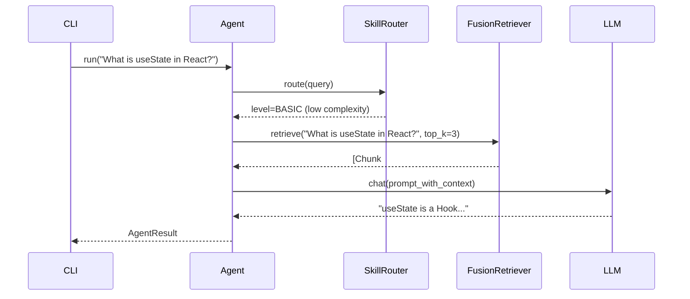
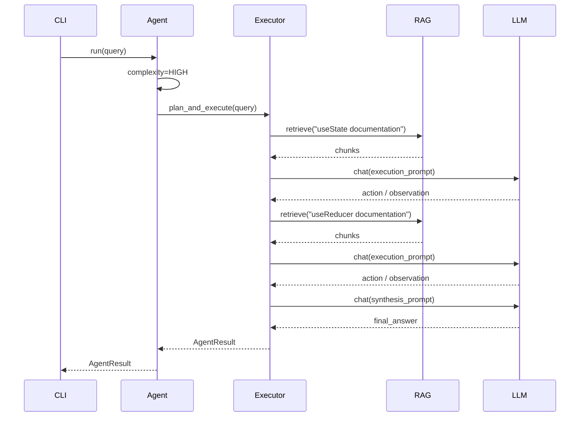

# Basic Query Example

> **Command:** `ragent query`
> **Mode:** Stateless, single-turn

---

## 1. Simple Factual Query

### Input

```bash
ragent query "What is useState in React?"
```

### Execution Flow



### Output

```markdown
useState is a React Hook that lets you add state to functional components.
It returns an array with two elements:
1. The current state value
2. A function to update it

Example:
```javascript
const [count, setCount] = useState(0);
```

Sources:
- react_hooks_guide.md#1
- react_hooks_guide.md#4
```

---

## 2. Complex Comparison Query

### Input

```bash
ragent query "Compare useState and useReducer with code examples"
```

### Execution Flow



### Output

```markdown
## useState vs useReducer

| Aspect | useState | useReducer |
|--------|----------|------------|
| Best for | Simple state | Complex state logic |
| Syntax | `const [s, setS] = useState(0)` | `const [s, d] = useReducer(r, 0)` |
| Updates | Direct value | Action objects |

### useState Example
```javascript
const [count, setCount] = useState(0);
setCount(count + 1);
```

### useReducer Example
```javascript
function reducer(state, action) {
  switch (action.type) {
    case 'increment': return state + 1;
    default: return state;
  }
}
const [count, dispatch] = useReducer(reducer, 0);
dispatch({ type: 'increment' });
```

When to use which:
- **useState**: Counters, toggles, simple form fields
- **useReducer**: Complex forms, state machines, deeply nested updates

Sources:
- react_hooks_guide.md#1 (useState)
- react_hooks_guide.md#5 (useReducer)
```

---

## 3. Error Handling Example

### Input (Invalid API Key)

```bash
ragent query "Explain useEffect"
# .env has invalid OPENAI_API_KEY
```

### Output

```
Request failed: Invalid API key. Check .env configuration.
   (Error code: LLM_AUTH)
```

### With --verbose

```bash
ragent query "Explain useEffect" --verbose
```

```
LLMAuthenticationError: Invalid API key
   Code: LLM_AUTH
   Retryable: False
   Provider: openai
   Context: {"model": "gpt-4o-mini"}
   Suggestion: Run `cp .env.example .env` and set OPENAI_API_KEY
```

---

## 4. JSON Output Mode

```bash
ragent query "What is useState?" --json
```

```json
{
  "success": true,
  "result": {
    "answer": "useState is a React Hook...",
    "sources": [
      {
        "source": "react_hooks_guide.md",
        "start_line": 1,
        "end_line": 10
      }
    ],
    "plan": {
      "steps_executed": 0,
      "complexity": "low"
    },
    "metadata": {
      "total_latency_ms": 1250,
      "retrieval_latency_ms": 45,
      "llm_latency_ms": 1205
    }
  }
}
```

---

## 5. With Custom Index

```bash
# First, build an index
ragent index ./my_docs/ --output ./index/my_docs

# Query against custom index
ragent query "Authentication flow" --index ./index/my_docs
```

---

## Command Reference

```bash
ragent query [OPTIONS] <QUERY>

Options:
  --index PATH          Path to pre-built index directory
  --skill-level LEVEL   Override auto-detected skill (basic|intermediate|advanced)
  --json                Output raw JSON instead of Markdown
  --verbose, -v         Show debug information and stack traces
  --no-rag              Disable retrieval (pure LLM response)
  --top-k N             Number of chunks to retrieve (default: 5)
```
