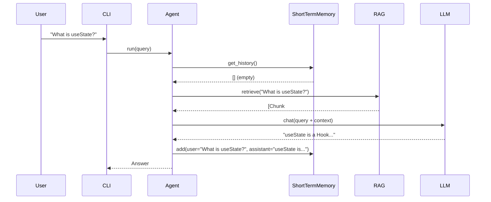
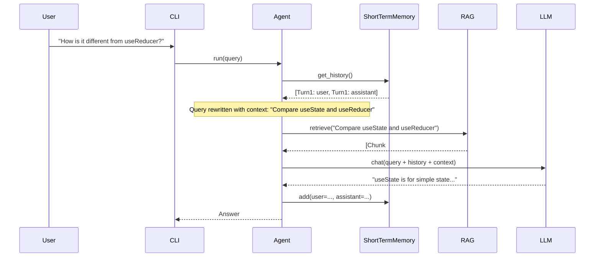
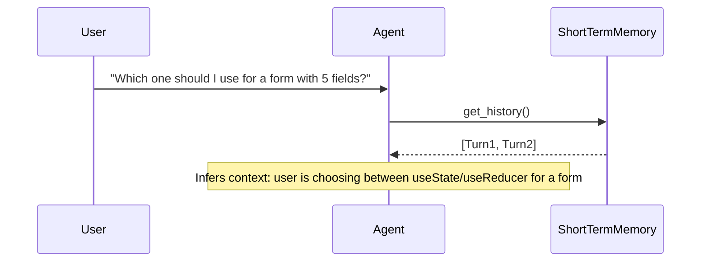

# Chat Session Example

> **Command:** `ragent chat`
> **Mode:** Interactive, multi-turn with ShortTermMemory

---

## 1. Starting a Session

```bash
ragent chat --index ./index/react
```

### Output

```
RAGent Chat (v0.1.0)
Index: ./index/react (1,234 chunks loaded)
Type 'exit' or press Ctrl+D to quit.

>
```

---

## 2. Multi-Turn Conversation

### Turn 1

```
> What is useState?
```

**Agent Processing:**


**Output:**
```markdown
useState is a React Hook that lets you add state to functional components.
It returns a state value and a setter function.

Example:
const [count, setCount] = useState(0);
```

---

### Turn 2 (Follow-up)

```
> How is it different from useReducer?
```

**Agent Processing:**


**Output:**
```markdown
useState is best for simple state (counters, toggles).
useReducer is better for complex state logic with multiple sub-values.

With useState, you update directly:
  setCount(count + 1)

With useReducer, you dispatch actions:
  dispatch({ type: 'increment' })
```

---

### Turn 3 (Context Maintenance)

```
> Which one should I use for a form with 5 fields?
```

**Agent Processing:**


**Output:**
```markdown
For a form with 5 fields, useReducer is usually cleaner.
It keeps validation logic centralized in the reducer function.

Example structure:
function formReducer(state, action) {
  switch (action.type) {
    case 'update_field':
      return {...state, [action.field]: action.value};
    case 'validate':
      return {...state, errors: validate(state)};
    default:
      return state;
  }
}
```

---

## 3. Session Commands

```
> /help              Show available commands
> /index ./new_docs  Switch to a different index
> /clear             Clear conversation history
> /history           Show conversation turns
> /save session.json Export conversation to file
> /exit              Quit session
```

---

## 4. Memory Behavior

| Turn | History Length | Oldest Turn | Action |
|------|---------------|-------------|--------|
| 1-10 | 1-10 | — | All retained |
| 11 | 11 | Turn 1 | All retained (within limit) |
| 12 | 10 | Turn 2 | Turn 1 dropped (FIFO) |
| 20 | 10 | Turn 10 | Continuous FIFO eviction |

**Note:** When a turn is evicted, its retrieved context chunks are also removed from working memory.

---

## 5. Error Recovery in Chat

```
> Analyze this API: https://example.com/api
```

**Scenario: web_fetch tool times out**

```
Attempting to fetch https://example.com/api...
Tool timeout after 10s. Retrying with fallback...
Fallback: Using cached snapshot from 2026-05-18

Based on the cached snapshot, the API has 3 endpoints:
- GET /users
- POST /users
- GET /users/:id
```

---

## Command Reference

```bash
ragent chat [OPTIONS]

Options:
  --index PATH          Path to pre-built index directory
  --skill-level LEVEL   Override auto-detected skill level
  --json                Output raw JSON per turn
  --verbose, -v         Show agent reasoning steps
  --max-turns N         Max history length (default: 10)
  --system-prompt TEXT  Custom system prompt
```
