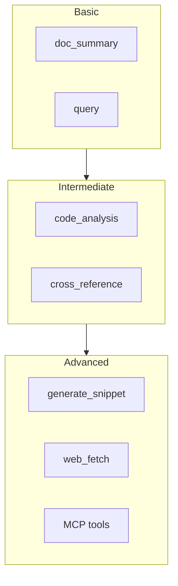
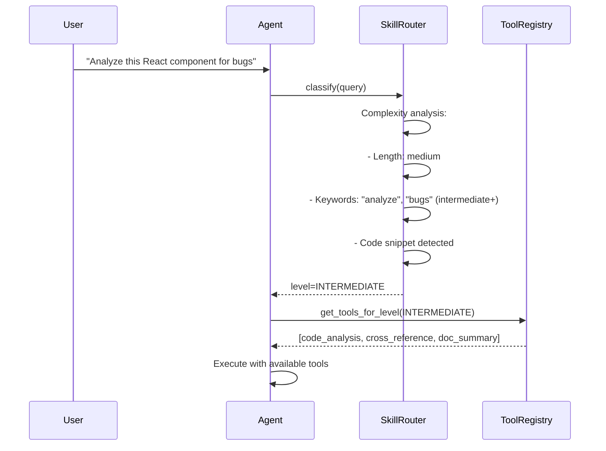

# Custom Skill Example

> **Skill System:** Progressive disclosure based on task complexity

---

## 1. Built-in Skill Levels



| Level | Tools | Typical Query |
|-------|-------|---------------|
| BASIC | doc_summary, query | "What is X?" |
| INTERMEDIATE | + code_analysis, cross_reference | "Compare X and Y" |
| ADVANCED | + generate_snippet, web_fetch, MCP | "Build me a Z using X and Y" |

---

## 2. Configuring Skill Levels

### 2.1 Programmatic Configuration

```python
from ragents.schema.skill import SkillConfig, SkillLevel

# Create a custom skill
custom_skill = SkillConfig(
    name="frontend_review",
    level=SkillLevel.INTERMEDIATE,
    enabled=True,
    tools=["code_analysis", "cross_reference", "doc_summary"]
)
```

### 2.2 Configuration File

```toml
# ragents.toml
[[skills]]
name = "frontend_review"
level = "intermediate"
enabled = true
tools = ["code_analysis", "cross_reference", "doc_summary"]

[[skills]]
name = "api_design"
level = "advanced"
enabled = true
tools = ["generate_snippet", "cross_reference", "web_fetch"]

[[skills]]
name = "basic_qa"
level = "basic"
enabled = true
tools = []  # Empty = all basic tools
```

### 2.3 Environment Variable

```bash
RAGENT_SKILL_LEVEL=intermediate
RAGENT_ENABLED_SKILLS=frontend_review,api_design
```

---

## 3. How Skill Routing Works



### 3.1 Complexity Heuristics

| Signal | Weight | Example |
|--------|--------|---------|
| Query length > 20 words | +1 | "Compare useState and useReducer with code examples" |
| Contains comparison words | +1 | "compare", "versus", "difference between" |
| Contains action words | +1 | "generate", "build", "create", "implement" |
| Contains code block | +1 | ```jsx ... ``` |
| Contains URL | +1 | "https://..." |
| Simple definition | 0 | "What is X?" |

**Thresholds:**
- Score 0-1: BASIC
- Score 2-3: INTERMEDIATE
- Score 4+: ADVANCED

---

## 4. CLI Override Examples

### 4.1 Force Basic Mode

```bash
ragent query "Build me a login form" --skill-level basic
```

**Result:** Agent only uses `doc_summary` and `query`.
It will NOT generate code, even though the query implies code generation.

```markdown
A login form typically consists of:
- Username/email input field
- Password input field
- Submit button
- Validation logic

See React documentation for implementation details.
```

### 4.2 Force Advanced Mode

```bash
ragent query "What is useState?" --skill-level advanced
```

**Result:** Agent has access to all tools including `generate_snippet`.
Even a simple question gets a comprehensive answer with generated examples.

```markdown
useState is React's fundamental state management Hook.

## Implementation Details

useState uses a closure over a component-scoped variable...

## Generated Example

```jsx
function Counter() {
  const [count, setCount] = useState(0);
  return (
    <button onClick={() => setCount(c => c + 1)}>
      Count: {count}
    </button>
  );
}
```

## Source Code Reference

The actual implementation in React source (v18.2.0):
...
```

---

## 5. Creating a Custom Skill

### Step 1: Define the Skill

```python
# src/ragents/skills/frontend_review.py
from ragents.schema.skill import SkillConfig, SkillLevel

config = SkillConfig(
    name="frontend_review",
    level=SkillLevel.INTERMEDIATE,
    enabled=True,
    tools=[
        "code_analysis",
        "cross_reference",
        "doc_summary",
    ],
)

# Custom routing logic
def should_activate(query: str) -> bool:
    keywords = ["component", "react", "jsx", "css", "bug", "performance"]
    return any(kw in query.lower() for kw in keywords)
```

### Step 2: Register in SkillRouter

```python
# src/ragents/agent/skill_router.py
from ragents.skills.frontend_review import config, should_activate

class SkillRouter:
    def __init__(self):
        self.custom_skills = {
            "frontend_review": (config, should_activate),
        }

    def route(self, query: str) -> SkillLevel:
        # Check custom skills first
        for name, (cfg, predicate) in self.custom_skills.items():
            if cfg.enabled and predicate(query):
                return cfg.level

        # Fall back to default heuristics
        return self._default_classify(query)
```

### Step 3: Add Tests

```python
# tests/unit/test_skill_router.py
from ragents.agent.skill_router import SkillRouter
from ragents.schema.skill import SkillLevel

def test_frontend_review_skill():
    router = SkillRouter()

    assert router.route("Review my React component") == SkillLevel.INTERMEDIATE
    assert router.route("Check CSS performance") == SkillLevel.INTERMEDIATE
    assert router.route("What is React?") == SkillLevel.BASIC  # No frontend keywords
```

---

## 6. Skill Audit Log

Every skill decision is logged for debugging:

```json
{
  "event": "skill_routing",
  "query": "Build a custom hook for data fetching",
  "detected_level": "advanced",
  "available_tools": [
    "doc_summary",
    "code_analysis",
    "cross_reference",
    "generate_snippet",
    "web_fetch"
  ],
  "complexity_score": 4,
  "signals": [
    {"type": "action_word", "word": "build", "weight": 1},
    {"type": "query_length", "words": 8, "weight": 0}
  ],
  "timestamp": "2026-05-19T11:00:00Z"
}
```

---

## 7. Best Practices

1. **Start restrictive:** New skills should default to BASIC and promote based on feedback.
2. **Tool overlap is OK:** Multiple skills can share the same tools.
3. **Explicit over implicit:** Users can always override with `--skill-level`.
4. **Monitor accuracy:** Log `detected_level` vs user override to tune heuristics.
