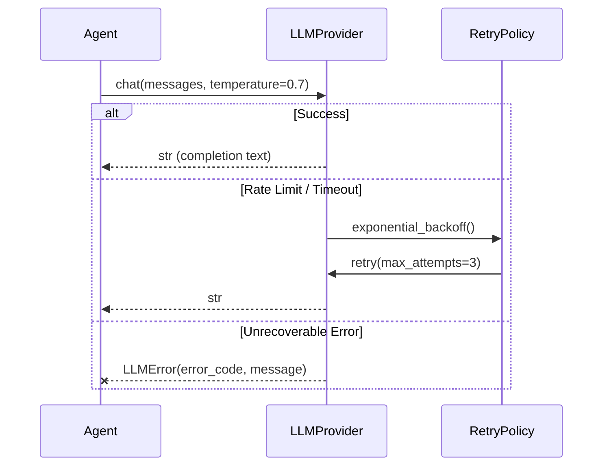
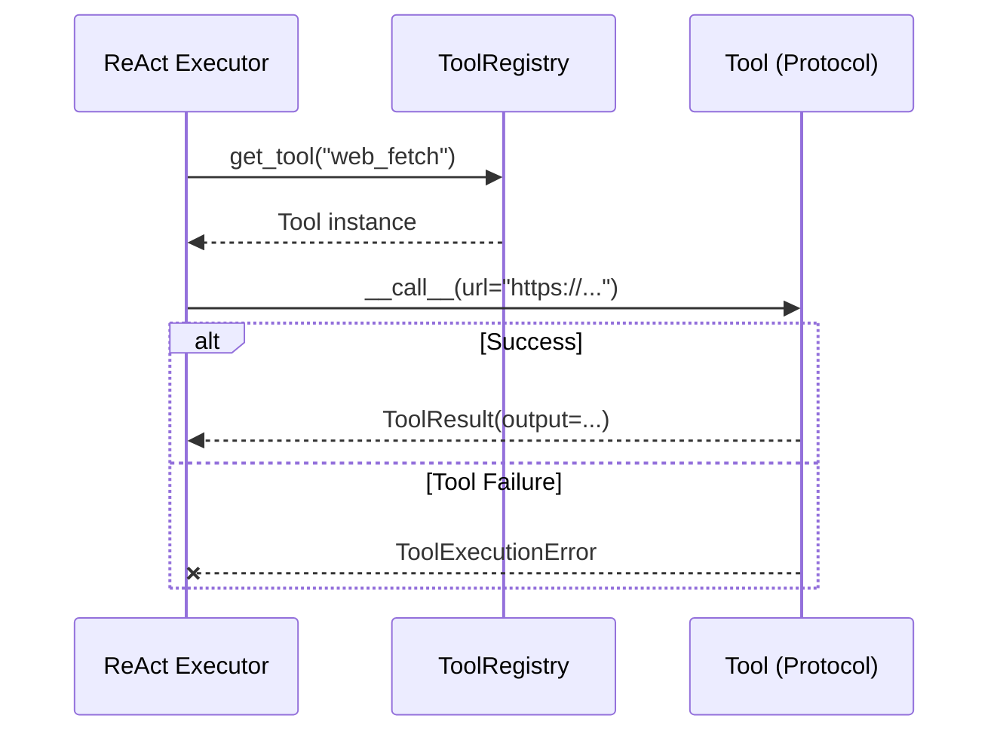
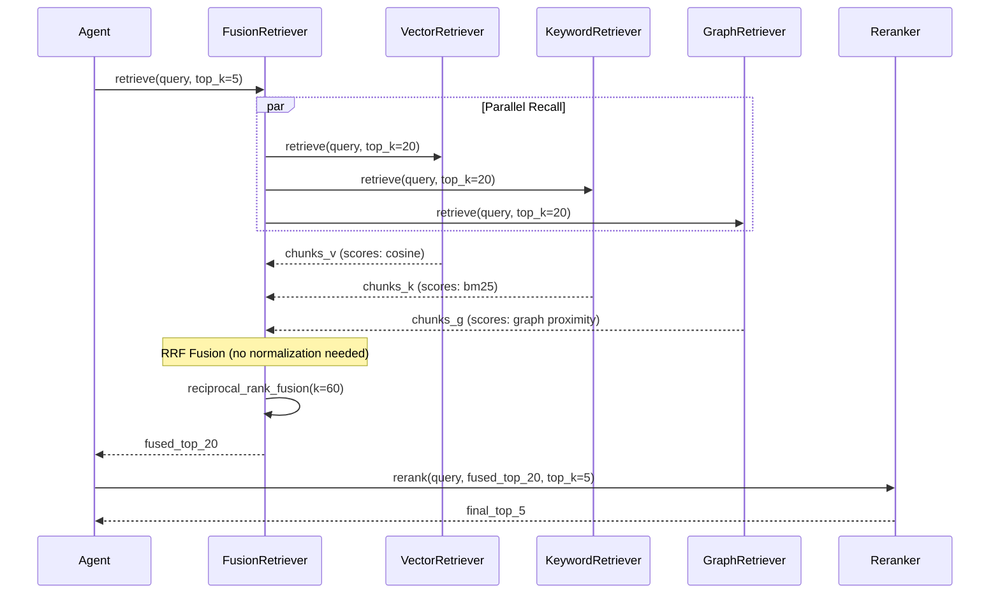
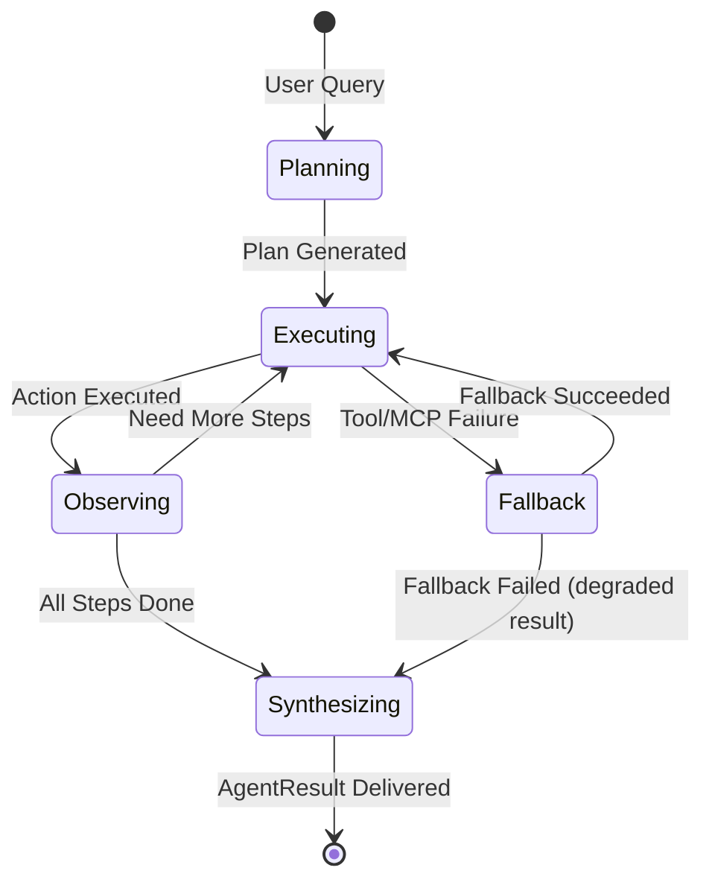

# Interface Contract Specification

> **Version:** 0.1.0
> **Scope:** All public interfaces across `llm`, `rag`, `tools`, `mcp`, `agent` layers.
> **Format:** OpenAPI-inspired structural spec with Mermaid sequence diagrams.

---

## 1. Design Principles

1. **Explicit over implicit** — Every method must declare its full signature, exceptions, and side effects. No hidden behavior or implicit conventions allowed.
2. **Fail fast at boundaries** — Input validation happens at the public API surface; internal methods trust typed inputs and do not repeat validation.
3. **Async-ready, sync-default** — Synchronous methods are primary for MVP; async variants (`a*` prefix) are optional extensions, delegating to sync implementations via `asyncio.to_thread` by default.
4. **Structured logging over exception diagnostics** — Exceptions carry machine-readable `error_code`; human-readable messages go to structured logs, not just exception text.
5. **Protocol over inheritance** — Extensible points like tools use `Protocol` structural subtyping to reduce coupling and enable third-party extensions.

---

## 2. LLMProvider Interface

`LLMProvider` is the sole abstraction layer for system interaction with large language models. All concrete providers (e.g., OpenAI, Anthropic, local models) must implement this interface.



### 2.1 chat Method

| Attribute | Value |
|-----------|-------|
| **Name** | `chat` |
| **Signature** | `chat(self, messages: list[dict[str, str]], *, temperature: float = 0.7, max_tokens: int \| None = None, **kwargs) -> str` |
| **Description** | Sends a chat completion request to the underlying LLM and returns generated text content. |
| **Parameters** | |
| `messages` | List of messages in format `{"role": "system\|user\|assistant", "content": "..."}`. Must contain at least one `user` message. |
| `temperature` | Sampling temperature controlling output randomness. Range `[0.0, 2.0]`; `0.0` approaches deterministic output. |
| `max_tokens` | Maximum tokens allowed in response. `None` means using the provider default. |
| `**kwargs` | Provider-specific parameters. |
| **Returns** | `str` — Generated text content. |
| **Raises** | |
| `LLMRateLimitError` | HTTP 429 or provider-specific rate limit. Retryable. |
| `LLMTimeoutError` | Socket timeout or read timeout. Retryable. |
| `LLMAuthenticationError` | HTTP 401/403, invalid API key. Non-retryable. |
| `LLMContentFilterError` | Content policy violation. Non-retryable. |
| `LLMError` | Generic unrecoverable error. |

### 2.2 embed Method

| Attribute | Value |
|-----------|-------|
| **Name** | `embed` |
| **Signature** | `embed(self, texts: list[str]) -> list[list[float]]` |
| **Description** | Generates dense vector embeddings for a batch of texts. |
| **Parameters** | |
| `texts` | Non-empty list of strings. Max batch size depends on provider (typically ≤ 2048). |
| **Returns** | `list[list[float]]` — Embedding vectors, one per input text. All vectors have identical dimensionality. |
| **Raises** | |
| `LLMError` | Batch too large, content filtered, or provider failure. |

### 2.3 Optional Async Variants

| Method | Signature | Default Behavior |
|--------|-----------|------------------|
| `achat` | `async def achat(self, messages, **kwargs) -> str` | Delegates to `chat` via `asyncio.to_thread`. |
| `aembed` | `async def aembed(self, texts) -> list[list[float]]` | Delegates to `embed` via `asyncio.to_thread`. |
| `stream_chat` | `def stream_chat(self, messages, **kwargs) -> Iterator[str]` | Raises `NotImplementedError` by default. |

---

## 3. Tool Protocol

Tools are **structural subtypes** (`Protocol`) rather than inheritance-based. Any callable or object satisfying the following interface can be registered in `ToolRegistry`.



### 3.1 Tool Protocol Definition

| Attribute | Type | Required | Description |
|-----------|------|----------|-------------|
| `name` | `str` | Yes | Unique identifier. Pattern: `^[a-z_][a-z0-9_]*$`. |
| `description` | `str` | Yes | Human-readable description for LLM tool selection. ≤ 1024 chars. |
| `parameters` | `dict` | Yes | JSON Schema object describing accepted arguments. |
| `skill_level` | `SkillLevel` | No | Default: `SkillLevel.BASIC`. Determines progressive disclosure. |

### 3.2 `__call__` Contract

| Attribute | Value |
|-----------|-------|
| **Signature** | `__call__(self, **kwargs) -> Any` |
| **Precondition** | `kwargs` must validate against `self.parameters` schema. Validation is performed by `ToolRegistry` **before** invocation. |
| **Postcondition** | On success, returns any JSON-serializable value. On failure, raises `ToolExecutionError`. |
| **Side Effects** | Must be idempotent where possible. Network calls must declare timeouts. |
| **Raises** | |
| `ToolExecutionError` | Runtime failure during tool execution. Must include `tool_name` and `original_error`. |
| `ToolTimeoutError` | Subclass of `ToolExecutionError`. Tool exceeded its declared timeout. |

### 3.3 ToolRegistry Boundary

`ToolRegistry` provides three core methods:

```python
class ToolRegistry:
    def register(self, tool: Tool) -> None: ...
    def get_tool(self, name: str) -> Tool: ...
    def call(self, name: str, **kwargs) -> ToolResult: ...
```

The `call()` method is the unified boundary:
1. Validates arguments against the tool's `parameters` schema
2. Catches exceptions and converts them to `ToolResult(error=...)`
3. Wraps successful returns in `ToolResult(output=...)`
4. Logs latency and retry counts

---

## 4. Retriever Interface



### 4.1 BaseRetriever

| Method | Signature | Description |
|--------|-----------|-------------|
| `retrieve` | `retrieve(self, query: str, top_k: int = 5) -> list[RetrievedChunk]` | Execute a single retrieval. |
| `add` | `add(self, chunks: list[Chunk]) -> None` | Index new chunks. May be a no-op for read-only retrievers. |
| `batch_retrieve` | `batch_retrieve(self, queries: list[str], top_k: int = 5) -> list[list[RetrievedChunk]]` | Default: `[self.retrieve(q, top_k) for q in queries]`. |

| Raises | Condition |
|--------|-----------|
| `RetrievalError` | Index corrupted, query parsing failed, or underlying storage error. |

### 4.2 Concrete Retriever Types

| Class | Index Type | `add()` Behavior | Best For |
|-------|-----------|------------------|----------|
| `VectorRetriever` | Dense vector store (HNSW / FAISS) | Compute embeddings via `Embedder`, then insert | Semantic similarity |
| `KeywordRetriever` | Inverted index (BM25 / Trie) | Tokenize and update posting lists | Exact match / prefix |
| `GraphRetriever` | Knowledge graph (RDF / LPG) | Extract entities/relations, merge into graph | Concept traversal |

---

## 5. Chunker Interface

| Method | Signature | Description |
|--------|-----------|-------------|
| `chunk` | `chunk(self, text: str, source: str) -> list[Chunk]` | Split raw text into semantic chunks. |
| `chunk_file` | `chunk_file(self, path: Path) -> list[Chunk]` | Default: reads file as UTF-8, then delegates to `chunk`. |

| Precondition | `text` must be non-empty; `source` must be a valid URI or file path. |
| Postcondition | Returned chunks are non-overlapping, ordered, and cover the full input text. |

### 5.1 Chunking Strategies

| Strategy | Class | Trigger Heuristic |
|----------|-------|-------------------|
| Markdown | `MarkdownChunker` | `source.endswith('.md')` or text contains `## ` headers |
| Code | `CodeChunker` | `source` matches `*.{py,js,ts,go,rs}` or AST parseable |
| Table | `TableChunker` | Text contains `|` or `<table>` patterns |
| Semantic | `SemanticChunker` | Fallback; uses sentence embeddings + breakpoint detection |

---

## 6. Embedder Interface

| Method | Signature | Description |
|--------|-----------|-------------|
| `embed` | `embed(self, texts: list[str]) -> list[list[float]]` | Batch embedding. Batch size should be handled internally. |
| `embed_query` | `embed_query(self, text: str) -> list[float]` | Default: `self.embed([text])[0]`. Convenience method for single queries. |
| `dimension` | `dimension(self) -> int` | Return the fixed output dimensionality (e.g., 768, 1536). |

| Raises | Condition |
|--------|-----------|
| `EmbeddingError` | Model not loaded, input too long, or batch dimension mismatch. |

---

## 7. Reranker Interface

| Method | Signature | Description |
|--------|-----------|-------------|
| `rerank` | `rerank(self, query: str, chunks: list[RetrievedChunk], top_k: int \| None = None) -> list[RetrievedChunk]` | Reorder chunks by relevance. If `top_k` is `None`, return all reranked. |

| Precondition | `chunks` may be empty. Must gracefully return empty list. |
| Postcondition | Output preserves all input chunks unless `top_k` limits the count. Scores are overwritten with reranker scores. |

---

## 8. Agent Interface



### 8.1 HybridAgent

| Method | Signature | Description |
|--------|-----------|-------------|
| `run` | `run(self, query: str, context: dict \| None = None) -> AgentResult` | Main entry point. Orchestrates complexity judgment → planner → executor → synthesizer. |
| `plan` | `plan(self, query: str) -> Plan` | Delegates to internal `Planner`. |
| `execute` | `execute(self, plan: Plan, context: dict \| None = None) -> list[Observation]` | Delegates to internal `Executor`. |

| Context Keys | Type | Description |
|--------------|------|-------------|
| `history` | `list[dict]` | Previous conversation turns for chat mode. |
| `skill_level` | `SkillLevel` | Override auto-detected skill level. |
| `index_path` | `str` | Path to pre-built index for RAG retrieval. |
| `system_prompt` | `str` | Custom system prompt for LLM context. |

| Raises | Condition |
|--------|-----------|
| `AgentPlanningError` | Planner failed to generate valid plan after max retries. |
| `AgentExecutionError` | Executor loop exceeded max steps or critical tool failure. |

---

## 9. MCP Client Interface

| Method | Signature | Description |
|--------|-----------|-------------|
| `connect` | `connect(self) -> None` | Establish transport (stdio / SSE). |
| `list_tools` | `list_tools(self) -> list[Tool]` | Discover tools from the server. |
| `call_tool` | `call_tool(self, name: str, arguments: dict) -> ToolResult` | Invoke a remote tool. |
| `health_check` | `health_check(self) -> MCPHealthStatus` | Return cached or fresh health status (healthy / degraded / down / failed). |
| `disconnect` | `disconnect(self) -> None` | Clean shutdown. |

| Raises | Condition |
|--------|-----------|
| `MCPConnectionError` | Transport failure or server process crashed. |
| `MCPTimeoutError` | Tool call exceeded configured timeout. |

---

## 10. Version Compatibility

| Version | Contract Change |
|---------|-----------------|
| `0.1.x` | Initial contracts; methods may gain optional kwargs but will not remove required parameters. |
| `0.2.0` | Planned: async interfaces (`achat`, `aembed`) become first-class instead of default sync wrappers. |

---

## Appendix: Glossary

| Term | Definition |
|------|------------|
| Chunk | A semantically coherent unit of text extracted from a document. |
| Embedding | A dense vector representation of text in high-dimensional space. |
| Fusion | Combining results from multiple retrievers into a single ranked list. |
| MCP | Model Context Protocol for tool server communication. |
| RAG | Retrieval-Augmented Generation. |
| RRF | Reciprocal Rank Fusion. |
| ReAct | Reasoning + Acting loop: Thought → Action → Observation. |
| Protocol | Structural typing interface; no inheritance required. |
