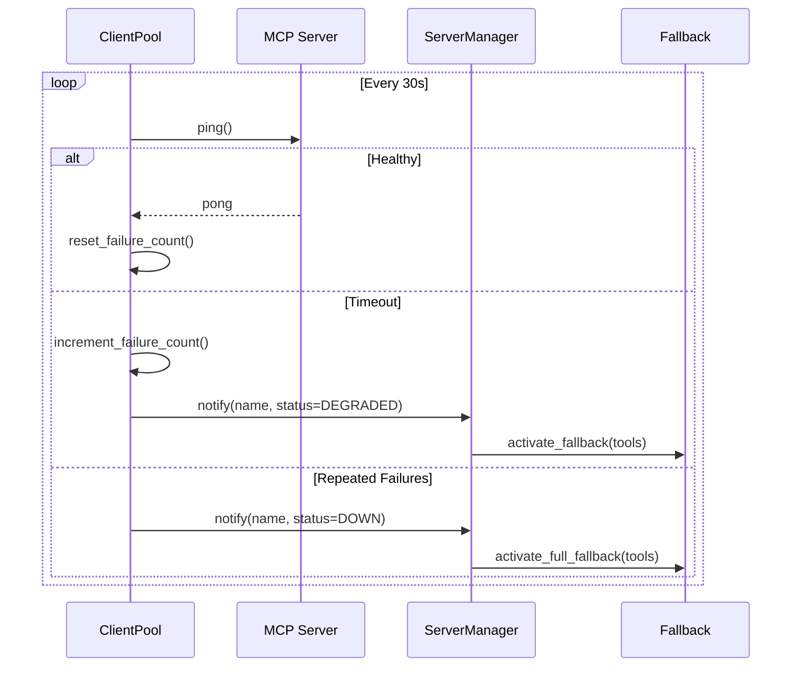
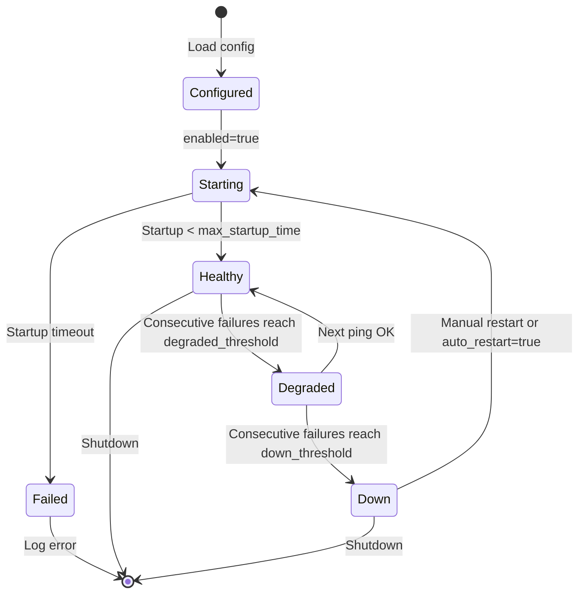
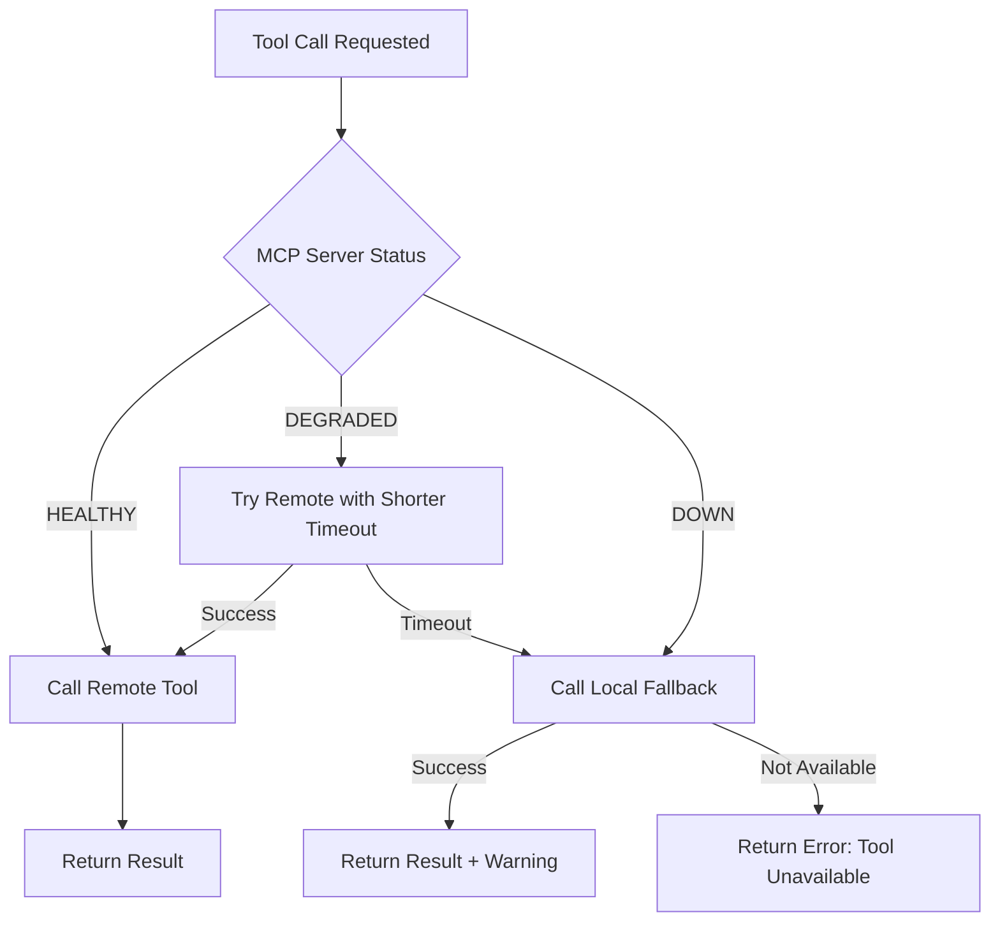

# MCP Server Configuration Guide

> **Version:** 0.1.0
> **Scope:** Installation, configuration, health monitoring, and fallback behavior.

---

## 1. Quick Setup

Run the provided setup script to install common MCP servers:

```bash
./scripts/setup_mcp.sh
```

Or install manually:

```bash
# Filesystem MCP (via npx)
npm install -g @modelcontextprotocol/server-filesystem

# PostgreSQL MCP (via uvx)
uvx mcp-server-postgres postgresql://localhost/mydb

# SQLite MCP
uvx mcp-server-sqlite --db-path ./data.db
```

---

## 2. Configuration Format

MCP servers are configured in **TOML** or **environment variables**.

### 2.1 TOML Configuration (Recommended)

Create or edit `ragents.toml` in the project root:

```toml
[mcp]
enabled = true
health_check_interval = 30.0

[[mcp.servers]]
name = "filesystem"
command = "npx"
args = ["-y", "@modelcontextprotocol/server-filesystem", "/home/user/docs"]
env = { NODE_NO_WARNINGS = "1" }
timeout = 30.0
enabled = true
fallback_tools = ["doc_summary", "web_fetch"]

[[mcp.servers]]
name = "postgres"
command = "uvx"
args = ["mcp-server-postgres", "postgresql://localhost:5432/mydb"]
timeout = 60.0
enabled = true
fallback_tools = []

[[mcp.servers]]
name = "sqlite"
command = "uvx"
args = ["mcp-server-sqlite", "--db-path", "./data.db"]
timeout = 10.0
enabled = false
```

### 2.2 JSON Configuration (Alternative)

```json
{
  "mcp": {
    "enabled": true,
    "servers": [
      {
        "name": "filesystem",
        "command": "npx",
        "args": ["-y", "@modelcontextprotocol/server-filesystem", "/home/user/docs"],
        "timeout": 30.0,
        "enabled": true,
        "fallback_tools": ["doc_summary"]
      }
    ]
  }
}
```

### 2.3 Environment Variables

For simple setups, use `.env`:

```bash
# MCP Filesystem Server
MCP_FILESYSTEM_COMMAND=npx
MCP_FILESYSTEM_ARGS=-y,@modelcontextprotocol/server-filesystem,/home/user/docs
MCP_FILESYSTEM_ENABLED=true
MCP_FILESYSTEM_TIMEOUT=30

# MCP PostgreSQL Server
MCP_POSTGRES_COMMAND=uvx
MCP_POSTGRES_ARGS=mcp-server-postgres,postgresql://localhost/mydb
MCP_POSTGRES_ENABLED=true
```

---

## 3. Configuration Schema

### 3.1 MCPServerConfig Fields

| Field | Type | Required | Default | Description |
|-------|------|----------|---------|-------------|
| `name` | `str` | Yes | — | Unique identifier. Pattern: `^[a-z0-9_-]+$`. |
| `command` | `str` | Yes | — | Executable name or absolute path. |
| `args` | `list[str]` | No | `[]` | Command-line arguments. |
| `env` | `dict` | No | `{}` | Environment variable overrides. |
| `enabled` | `bool` | No | `true` | Auto-start on agent initialization. |
| `timeout` | `float` | No | `30.0` | Tool call timeout in seconds. |
| `fallback_tools` | `list[str]` | No | `[]` | Local tool names to activate when this server is down. |
| `max_startup_time` | `float` | No | `10.0` | Max seconds to wait for process spawn. |

### 3.2 Global MCP Settings

```toml
[mcp]
enabled = true
health_check_interval = 30.0
connection_timeout = 5.0
degraded_threshold = 2
down_threshold = 5
auto_restart = false
```

| Field | Type | Default | Description |
|-------|------|---------|-------------|
| `enabled` | `bool` | `true` | Master switch. |
| `health_check_interval` | `float` | `30.0` | Health ping interval. |
| `connection_timeout` | `float` | `5.0` | TCP/stdio connection timeout. |
| `degraded_threshold` | `int` | `2` | Failures before marking DEGRADED. Must be >= 1. |
| `down_threshold` | `int` | `5` | Failures before marking DOWN. Must be >= `degraded_threshold`. |
| `auto_restart` | `bool` | `false` | Auto-restart DOWN servers. |

---

## 4. Health Checks

### 4.1 Health Check Flow



### 4.2 Health Status Transitions



### 4.3 CLI Health Commands

```bash
# Check all servers
ragent mcp list

# Expected output:
# NAME        STATUS     HEALTHY_SINCE    TOOLS
# filesystem  healthy    2m ago           read_file, list_directory
# postgres    degraded   —                — (fallback active)
# sqlite      down       —                — (fallback active)

# Test a specific server
ragent mcp test filesystem
# filesystem: healthy (3 tools available)

# Restart a server
ragent mcp restart postgres
# Restarting postgres... Healthy
```

---

## 5. Fallback Behavior

### 5.1 Fallback Trigger Conditions

| Server Status | Trigger | Action |
|--------------|---------|--------|
| `DEGRADED` | Consecutive failures reach `degraded_threshold` | Mark tools as slow; queue health re-check. |
| `DOWN` | Consecutive failures reach `down_threshold` | Unregister remote tools; register local fallback tools. |
| `Failed` | Spawn error | Immediate fallback; no retry. |

### 5.2 Fallback Resolution Flow



### 5.3 Fallback Configuration Examples

```toml
# Example: filesystem MCP with full local fallback
[[mcp.servers]]
name = "filesystem"
command = "npx"
args = ["-y", "@modelcontextprotocol/server-filesystem", "/docs"]
fallback_tools = ["doc_summary", "web_fetch"]
# When filesystem MCP is down:
# - read_file → fallback to doc_summary (partial: only cached docs)
# - list_directory → no fallback (returns error)

# Example: postgres MCP with no fallback
[[mcp.servers]]
name = "postgres"
command = "uvx"
args = ["mcp-server-postgres", "postgresql://localhost/db"]
fallback_tools = []
# When postgres is down: queries requiring DB fail immediately
# This is intentional — stale data is worse than no data
```

### 5.4 Runtime Fallback Log

When fallback is activated, the following is logged:

```json
{
  "event": "mcp_fallback_activated",
  "server": "filesystem",
  "previous_status": "healthy",
  "new_status": "down",
  "fallback_tools": ["doc_summary", "web_fetch"],
  "affected_tools": ["read_file", "list_directory"],
  "timestamp": "2026-05-19T10:30:00Z"
}
```

---

## 6. Troubleshooting

### 6.1 Server Won't Start

```bash
# Check if command exists
which npx
which uvx

# Test command manually
npx -y @modelcontextprotocol/server-filesystem /home/user/docs

# Check logs
ragent mcp test filesystem --verbose
```

### 6.2 Connection Timeouts

| Cause | Solution |
|-------|----------|
| Firewall blocking stdio/SSE | Check `localhost` rules; use `--transport stdio` |
| Slow tool execution | Increase `timeout` in config |
| Resource exhaustion | Reduce concurrent MCP servers |

### 6.3 Tool Discovery Failures

```bash
# Force re-discovery
ragent mcp refresh filesystem

# List discovered tools
ragent mcp tools filesystem
```

---

## 7. Security Considerations

1. **Command Injection:** Never interpolate user input into `command` or `args`.
2. **Env Leakage:** `.env` files containing MCP secrets must be in `.gitignore`.
3. **Scope Limitation:** Filesystem MCP should only access designated directories.
4. **Timeouts:** Always set `timeout` to prevent hanging processes.

---

## 8. Supported MCP Servers

| Server | Install Command | Use Case |
|--------|----------------|----------|
| filesystem | `npx -y @modelcontextprotocol/server-filesystem` | Read/write local files |
| postgres | `uvx mcp-server-postgres <conn>` | SQL database queries |
| sqlite | `uvx mcp-server-sqlite --db-path <file>` | Lightweight SQL |
| fetch | `uvx mcp-server-fetch` | HTTP requests (safer than raw `web_fetch`) |
| git | `uvx mcp-server-git` | Repository operations |

---

## Appendix: Config Validation

RAGent validates MCP config on startup. Common errors:

```
Error: MCP server 'filesystem' command 'npx' not found in PATH
Fix: Install Node.js or use absolute path to npx

Error: MCP server 'postgres' fallback_tools contains unknown tool 'db_query'
Fix: Add 'db_query' to tools/registry.py or remove from fallback_tools

Error: MCP server 'sqlite' timeout (600.0) exceeds global max (300.0)
Fix: Reduce timeout or increase global max in [mcp] section
```
