# 架构设计详解

> **版本：** 0.1.0
> **最后更新：** 2026-05-19

---

## 1. 系统概览

RAGent 是一个**混合 RAG-Agent** 系统，结合了以下四种核心范式：

- **Plan-and-Execute（计划并执行）** — 用于复杂多步任务的宏观规划。
- **ReAct（推理 + 行动）** — 用于工具增强执行的微观循环。
- **多路检索（向量 + 关键词 + 图谱）** — 用于事实 grounding 的高覆盖率召回。
- **MCP 协议** — 用于动态工具生态集成，支持外部工具的即插即用。

**版本边界：**

| 阶段 | 必须实现 | 延后实现 |
|------|----------|----------|
| `0.1.x` MVP | CLI、短期记忆、Planner、ReAct Executor、Vector + Keyword 检索、RRF 融合、可选 Reranker、ToolRegistry、基础 LLMProvider | GraphRetriever、长期记忆、MCP 自动恢复、分布式检索、LLM 结果缓存 |
| `0.2.x` 扩展 | MCP ClientPool、GraphRetriever、原生异步接口、索引 manifest / checksum | 多租户、跨会话长期记忆、水平扩展 |

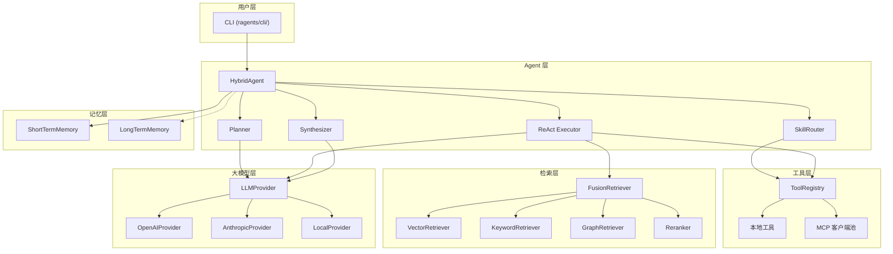

---

## 2. 分层职责

### 2.1 CLI 层（用户层）

**职责：**
- 解析用户输入（命令、标志位、查询语句）
- 渲染输出（Markdown、表格、进度条，通过 `rich` 库实现）
- 处理顶层错误边界（全捕获异常处理器，将系统异常转换为用户友好消息）
- 加载配置和环境变量

**入口点：**

| 命令 | 模块 | Agent 模式 | 记忆 |
|------|------|-----------|------|
| `ragent "..."` | `commands/query.py` | 单次查询，无历史 | 无状态 |
| `ragent chat` | `commands/chat.py` | 交互式 | ShortTermMemory |
| `ragent index` | `commands/index.py` | 无 Agent | — |
| `ragent mcp` | `commands/mcp.py` | 管理命令 | — |

---

### 2.2 Agent 层（编排核心）

Agent 层是系统的**编排核心**。它决定：是否需要规划、使用哪些工具、如何综合最终答案。

**职责边界：**
- `HybridAgent` 只负责总控流程：复杂度判断、上下文组装、调用 `Planner` / `Executor` / `Synthesizer`，以及返回 `AgentResult`。
- `Planner` 只负责生成和校验计划，不直接调用工具或检索器。
- `Executor` 拥有执行期依赖：`ToolRegistry`、`FusionRetriever`、MCP Client 和执行期 LLM 调用。
- `Synthesizer` 负责把观察结果、检索证据和历史上下文整理成最终回答。
- `SkillRouter` 只决定工具可见等级，不执行工具。

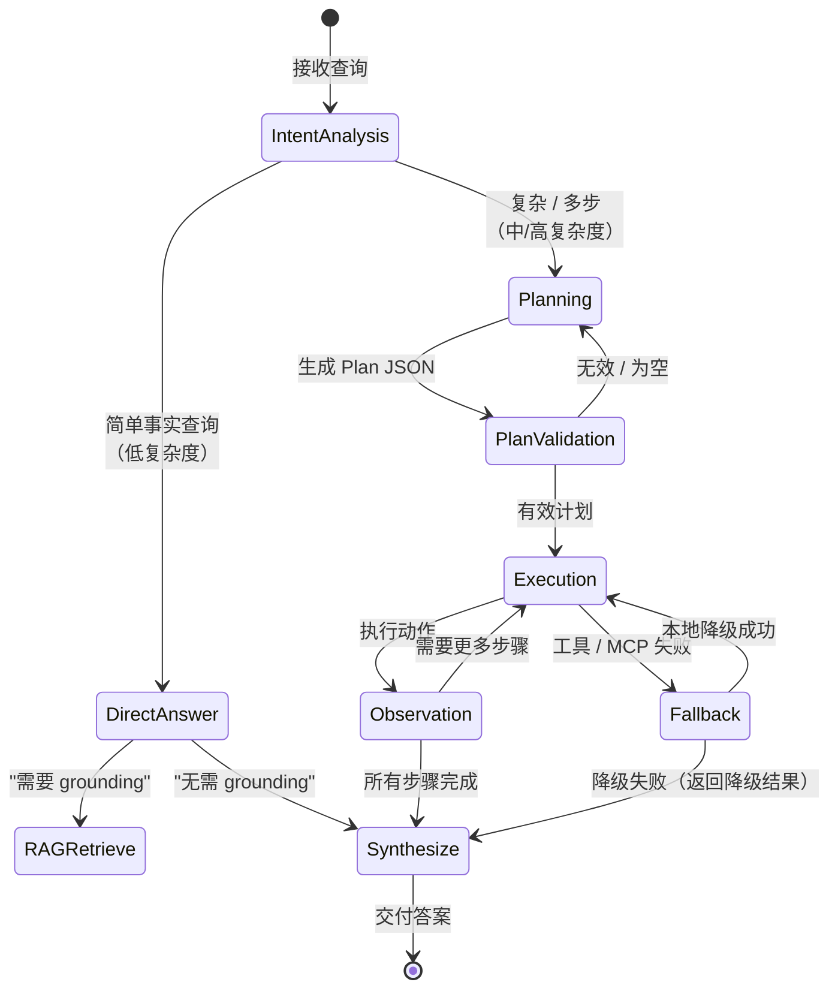

#### HybridAgent 决策流程

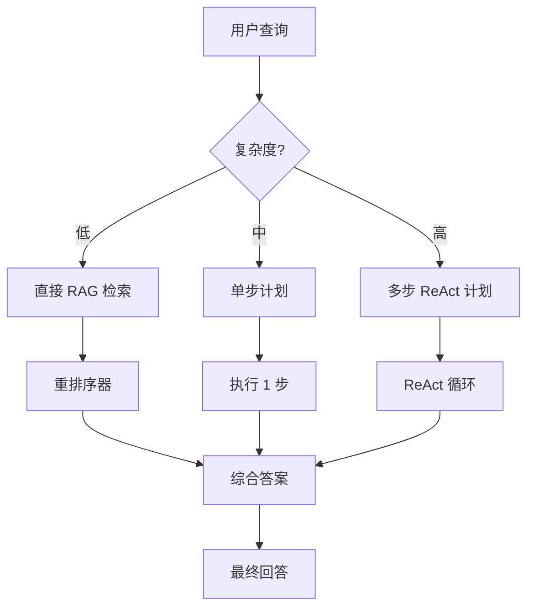

| 复杂度 | 启发式规则 | 规划器行为 | 最大步数 |
|--------|-----------|-----------|----------|
| 低 | 单一实体，无比较 | 跳过规划器；直接 RAG 检索 | 0 |
| 中 | 比较、因果关系 | 生成 1~3 步计划 | 3 |
| 高 | 多文档综合、代码生成 | 生成完整 ReAct 计划 | 10 |

---

### 2.3 RAG 层（检索层）

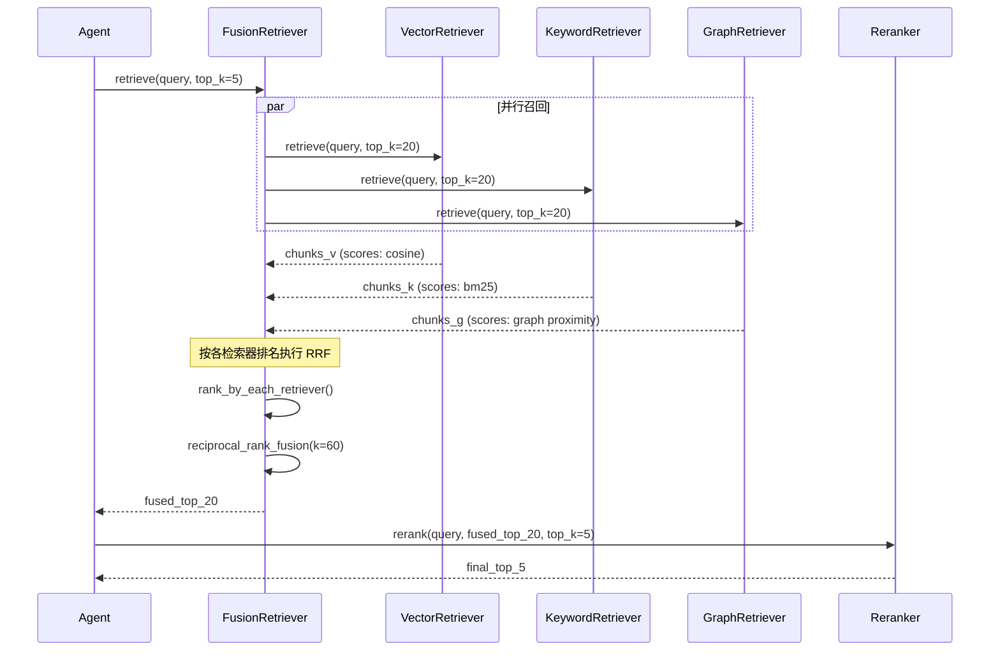

#### 倒数排名融合（RRF）公式

```
RRF_score(d) = Σ 1 / (k + rank_r(d))
```

其中：
- `k = 60`（常数，防止高排名项过度主导）
- `rank_r(d)` = 文档 `d` 在检索器 `r` 中的排名（从 1 开始）
- 未被某检索器排名的文档视为 `rank = ∞`（贡献值为 0）

#### RAG 层组件

| 组件 | 职责 | 关键技术 |
|------|------|----------|
| `FusionRetriever` | 协调多路检索，执行基于排名的 RRF 融合 | RRF、可选权重 |
| `VectorRetriever` | 基于稠密向量相似度召回 | HNSW、余弦相似度 |
| `KeywordRetriever` | 基于稀疏信号的精确/模糊匹配 | BM25、Trie |
| `GraphRetriever` | 基于知识图谱的关系遍历（v0.2 预留） | RDF / LPG |
| `Reranker` | 对融合结果进行精细化重排序 | Cross-Encoder |

---

### 2.4 工具层（Tool Layer）

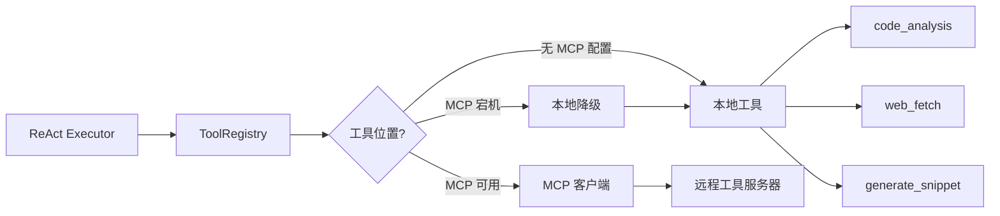

**渐进式披露：**

| 技能等级 | 暴露的工具 | 示例查询 |
|----------|-----------|----------|
| 基础 | `doc_summary`、`query` | "什么是 useState？" |
| 中级 | 增加 `code_analysis`、`cross_reference` | "比较 useState 和 useReducer" |
| 高级 | 增加 `generate_snippet`、`web_fetch`、MCP 工具 | "生成一个数据获取的自定义 Hook，并验证其是否符合 React 文档" |

---

### 2.5 MCP 层

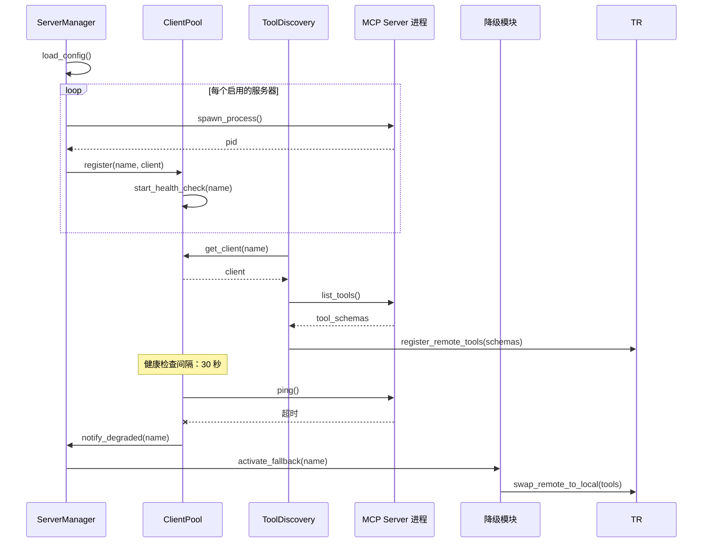

**生命周期状态：**

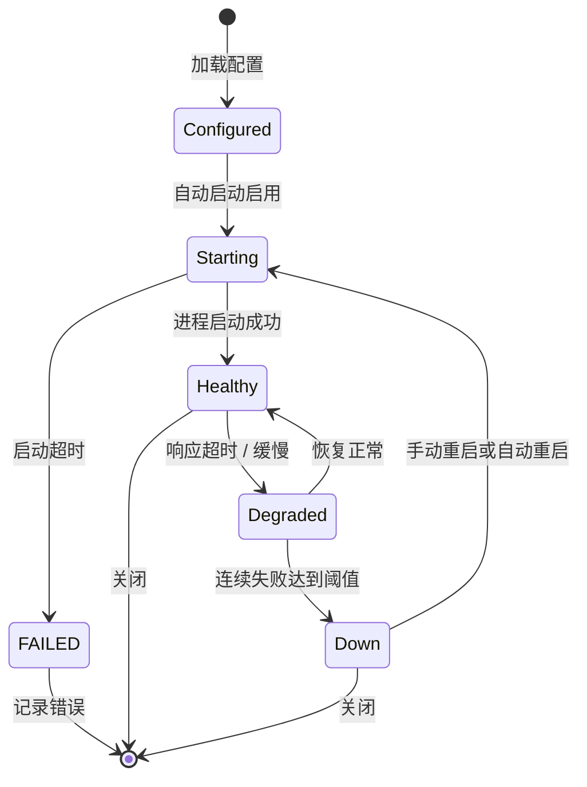

---

### 2.6 大模型层（LLM Layer）

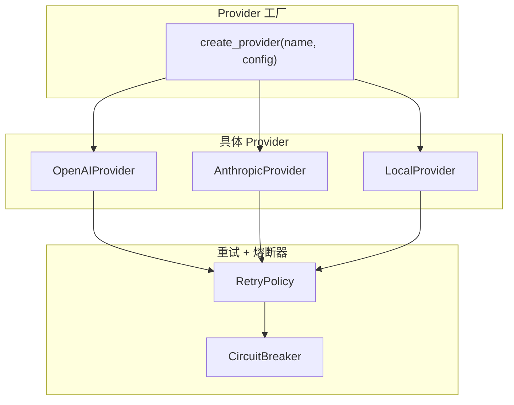

**Provider 选择逻辑：**

```python
def select_provider(task_type, complexity, settings):
    if task_type == "planning" and complexity == "high":
        return create_provider(settings.llm.planning_provider)
    elif task_type == "embed":
        return create_provider(settings.llm.embedding_provider)
    elif task_type == "chat" and not internet:
        return create_provider(settings.llm.local_fallback_provider)
    else:
        return default_provider
```

---

### 2.7 记忆层（Memory Layer）

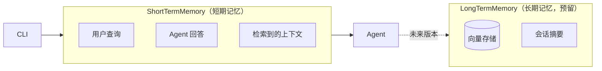

**短期记忆设计：**
- 环形缓冲区，保留最近 N 轮对话（默认 10 轮）。
- 存储原始消息 + 检索到的上下文分块 ID。
- 自动注入 `Planner` 和 `Executor` 的上下文中。

**长期记忆（v0.2 预留）：**
- 跨会话的向量记忆，用于追踪重复出现的话题。
- 自动会话摘要生成。
- 用户偏好学习。

---

## 3. 数据流图

### 3.1 查询流（直接模式）

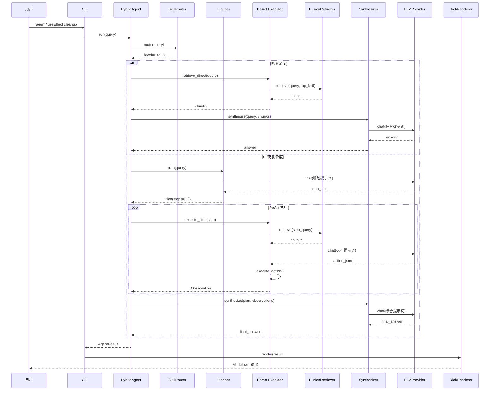

### 3.2 索引流

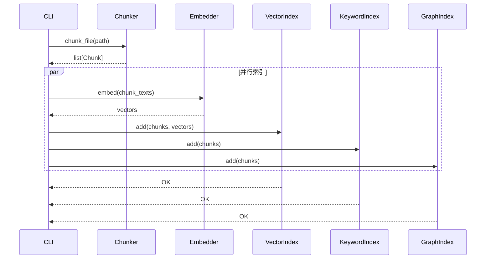

### 3.3 聊天流（交互模式）

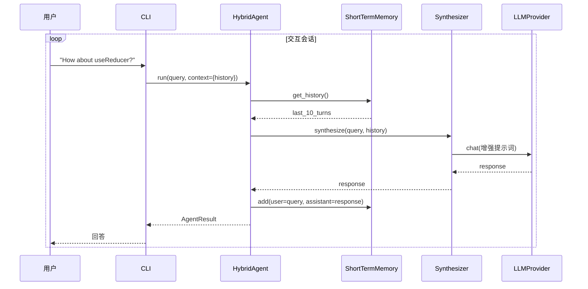

---

## 4. 组件交互矩阵

矩阵只描述跨层直接调用。`HybridAgent` 不直接持有 `LLMProvider`、`ToolRegistry` 或 `FusionRetriever`，而是通过 `Planner`、`Executor` 和 `Synthesizer` 间接使用这些能力，避免总控对象膨胀。

| 调用方 → 被调用方 | LLMProvider | ToolRegistry | FusionRetriever | Chunker | Embedder | MCP Client | Memory |
|----------------|-------------|--------------|-----------------|---------|----------|------------|--------|
| **CLI** | — | — | — | — | — | — | — |
| **HybridAgent** | — | — | — | — | — | — | get, add |
| **Planner** | chat | — | — | — | — | — | get |
| **Executor** | chat | get, call | retrieve | — | — | — | get |
| **Synthesizer** | chat | — | — | — | — | — | get |
| **ToolRegistry** | — | — | — | — | — | call_tool | — |
| **FusionRetriever** | — | — | — | — | — | — | — |
| **Chunker** | — | — | — | — | — | — | — |
| **MCP Client** | — | — | — | — | — | — | — |

---

## 5. 配置架构

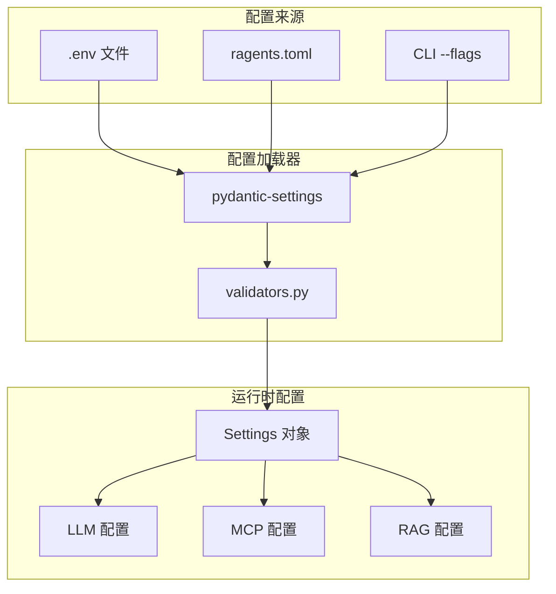

**优先级（从高到低）：**
1. CLI 参数（`--model`、`--index`）
2. 环境变量（`OPENAI_API_KEY`）
3. `.env` 文件
4. `ragents.toml`
5. `Settings` 模型中的默认值

`pyproject.toml [tool.ragents]` 仅作为兼容入口保留；若同时存在，`ragents.toml` 优先。

---

## 6. 可扩展性考量

### 6.1 水平扩展（未来规划）

| 组件 | 扩展策略 |
|------|----------|
| LLMProvider | 多 API Key 负载均衡；本地模型通过 vLLM 做副本扩展 |
| MCP Client | 连接池化；基于健康检查的路由 |
| FusionRetriever | 按文档集合分片；并行检索器进程 |
| Embedder | 批处理；本地模型的 GPU 卸载 |

### 6.2 缓存策略

| 层级 | 缓存目标 | TTL | 失效方式 |
|------|---------|-----|----------|
| LLM | 聊天补全（精确匹配） | 1 小时 | 手动 / API Key 变更 |
| RAG | 嵌入向量 | 永久 | 文档重新索引 |
| 工具 | 网页抓取结果 | 5 分钟 | 手动 |
| MCP | 工具模式（schema） | 直到断开连接 | 服务器重启 |

---

## 7. 技术栈

| 层级 | 主要依赖库 | 备选方案 |
|------|-----------|----------|
| CLI | `argparse` + `rich` | `typer`、`click` |
| Schema | `pydantic` v2 | — |
| 配置 | `pydantic-settings` | `python-dotenv` |
| 日志 | `structlog` | 标准库 `logging` |
| LLM | `openai`、`anthropic` SDK | `litellm`（未来） |
| RAG（向量） | `numpy` + 自定义 HNSW | `faiss`、`chromadb` |
| RAG（关键词） | `rank-bm25` | `whoosh` |
| RAG（图谱） | `networkx` | `neo4j` |
| MCP | `mcp` SDK（官方） | 自定义 stdio/SSE |
| 测试 | `pytest` | — |
| 打包 | `hatchling` + `uv` | `poetry`、`pdm` |

---

## 附录：文件组织说明

**为什么使用 `src/ragents/` 而非根目录的 `ragents/`？**

`src-layout`（将源码放在 `src/` 下）可防止意外导入开发目录。它确保：
1. 测试针对**已安装**的包运行，而非源码树本身。
2. 除非包已正确安装，否则 `import ragents` 会失败。
3. 构建产物与源码清晰分离。
