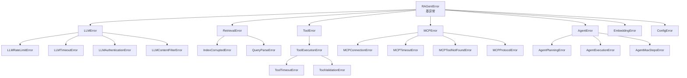
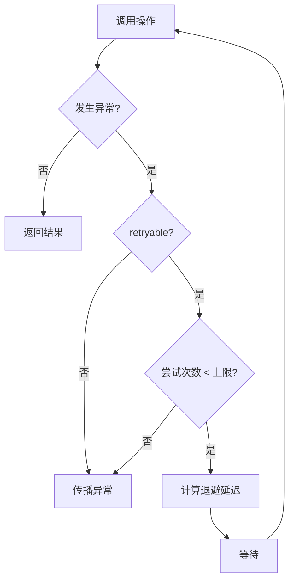
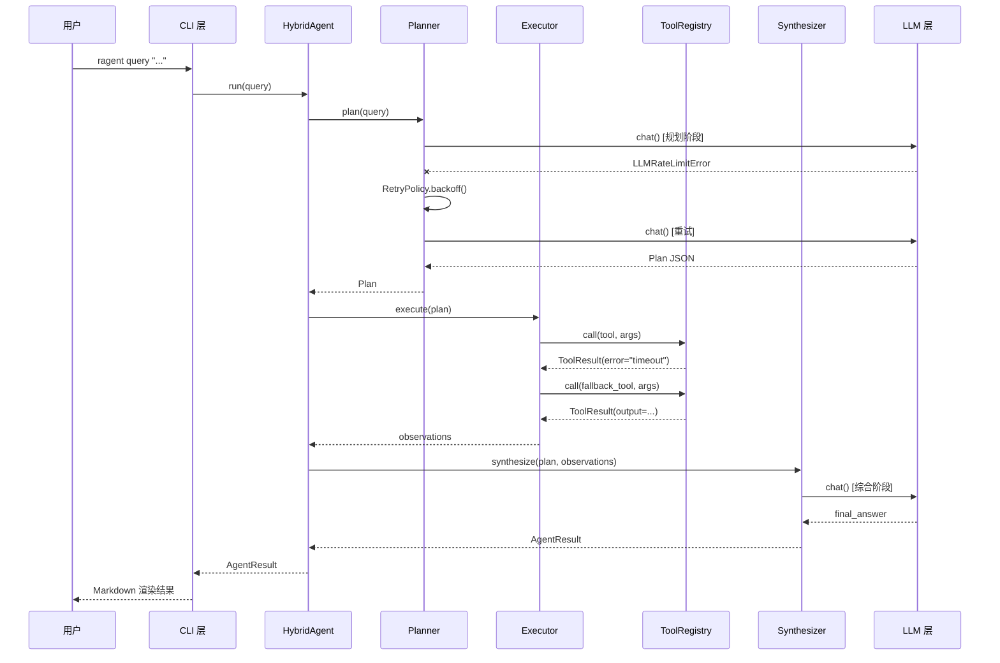

# 错误处理策略

> **策略：** 选项 A — 分层异常层次结构
> **设计理念：** 在边界快速失败，在适当位置重试，在 CLI 层优雅降级。

---

## 1. 异常层次结构



---

## 2. 基异常类

```python
class RAGentError(Exception):
    """所有 RAGent 异常的基类。

    属性：
        error_code: 机器可读的错误码（如 "LLM_RATE_LIMIT"）。
        message: 人类可读的描述。
        retryable: 该操作是否可以重试。
        context: 用于日志记录的附加键值上下文。
    """

    error_code: str = "UNKNOWN"
    retryable: bool = False

    def __init__(self, message: str, *, context: dict | None = None):
        super().__init__(message)
        self.message = message
        self.context = context or {}
```

### 2.1 错误码规范

格式：`{LAYER}_{CAUSE}`

| 前缀 | 层级 | 示例 |
|------|------|------|
| `LLM_*` | 大模型提供层 | `LLM_RATE_LIMIT`、`LLM_TIMEOUT`、`LLM_AUTH`、`LLM_CONTENT_FILTER` |
| `RETRIEVAL_*` | RAG / 检索层 | `RETRIEVAL_INDEX_CORRUPTED`、`RETRIEVAL_QUERY_PARSE` |
| `TOOL_*` | 本地工具层 | `TOOL_EXECUTION`、`TOOL_TIMEOUT`、`TOOL_VALIDATION` |
| `MCP_*` | MCP 协议层 | `MCP_CONNECTION`、`MCP_TIMEOUT`、`MCP_TOOL_NOT_FOUND` |
| `AGENT_*` | Agent 核心层 | `AGENT_PLANNING`、`AGENT_EXECUTION`、`AGENT_MAX_STEPS` |
| `EMBED_*` | 嵌入器层 | `EMBED_MODEL_NOT_LOADED`、`EMBED_BATCH_TOO_LARGE` |
| `CONFIG_*` | 配置层 | `CONFIG_MISSING_KEY`、`CONFIG_PARSE_ERROR` |

---

## 3. 分层异常定义

### 3.1 LLMError 家族

| 异常 | `retryable` | 触发条件 | 重试策略 |
|------|-------------|----------|----------|
| `LLMRateLimitError` | `True` | HTTP 429，或响应头 `x-ratelimit-remaining: 0` | 指数退避：`base * (2 ** attempt)` |
| `LLMTimeoutError` | `True` | 套接字超时、读取超时 | 固定延迟 + 随机抖动后重试 |
| `LLMAuthenticationError` | `False` | HTTP 401/403，API Key 无效 | 立即失败；记录安全事件日志 |
| `LLMContentFilterError` | `False` | 内容策略违规（输入或输出被过滤） | 立即失败；建议用户改写查询 |
| `LLMError` | `False` | 通用/未分类错误（如模型不存在） | 立即失败 |

### 3.2 RetrievalError 家族

| 异常 | `retryable` | 触发条件 |
|------|-------------|----------|
| `IndexCorruptedError` | `False` | 索引校验和不匹配、索引文件不可读 |
| `QueryParseError` | `False` | 查询语法错误（如图查询中的 Cypher 语法错误） |
| `RetrievalError` | `False` | 通用存储错误（磁盘满、权限不足等） |

### 3.3 ToolError 家族

| 异常 | `retryable` | 触发条件 |
|------|-------------|----------|
| `ToolExecutionError` | 取决于工具配置 | 运行时失败（网络错误、文件不存在等） |
| `ToolTimeoutError` | `True` | 超出工具声明的 `timeout` |
| `ToolValidationError` | `False` | 参数未通过 JSON Schema 校验 |

**工具重试策略：**
每个工具在注册表中声明自己的 `max_retries` 和 `retryable_exceptions`。默认：副作用重的工具（如文件写入）`max_retries=0`；幂等查询类工具（如 `web_fetch`）可配置 `max_retries=2`。

`ToolRegistry.call()` 必须捕获工具实现抛出的异常，并将其转换为 `ToolResult(error=...)` 返回给 ReAct Executor。只有注册表本身不可用、工具 schema 缺失等框架级问题才应继续向上抛出 `ToolError`。

### 3.4 MCPError 家族

| 异常 | `retryable` | 触发条件 | 降级操作 |
|------|-------------|----------|----------|
| `MCPConnectionError` | `True`（最多 3 次） | stdio 管道断开、SSE 连接断开 | 切换到本地降级工具 |
| `MCPTimeoutError` | `True`（1 次） | 工具调用超出服务器配置的超时 | 切换到本地降级工具 |
| `MCPToolNotFoundError` | `False` | 服务器响应正常但工具未知 | 记录不匹配日志；跳过该工具 |
| `MCPProtocolError` | `False` | 协议版本不匹配、消息格式错误 | 跳过该服务器 |

### 3.5 AgentError 家族

| 异常 | `retryable` | 触发条件 |
|------|-------------|----------|
| `AgentPlanningError` | `True`（1 次，使用更高 temperature） | 规划器生成的计划不是有效 JSON 或为空 |
| `AgentExecutionError` | `False` | 关键工具链失败，或执行器遇到不可恢复错误 |
| `AgentMaxStepsError` | `False` | 执行器达到 `max_steps` 上限（默认 10 步） |

---

## 4. 重试策略规范



### 4.1 指数退避公式

```
delay = min(base * (2 ** attempt) + random jitter, max_delay)
```

| 参数 | 默认值 | 描述 |
|------|--------|------|
| `base` | `1.0` 秒 | 初始延迟。 |
| `max_attempts` | 依层级而定 | LLM：3 次；MCP：3 次；工具：0~2 次（按工具配置）。 |
| `max_delay` | `60.0` 秒 | 硬上限，防止过度等待。 |
| `jitter` | `random.uniform(0, 1)` | 随机抖动，防止惊群效应。 |

### 4.2 熔断器集成

`RetryPolicy` 与 `CircuitBreaker` 协同工作，防止级联故障：

- **关闭状态（Closed）：** 正常操作；每次失败增加计数器。连续成功时计数器递减。
- **打开状态（Open）：** 连续失败达到 `failure_threshold` 后，在 `recovery_timeout` 秒内快速拒绝所有请求，直接抛出 `CircuitBreakerOpenError`。
- **半开状态（Half-Open）：** 超时后允许一次探测请求。成功 → 关闭；失败 → 打开。

```python
class CircuitBreaker:
    def __init__(self, failure_threshold: int = 5, recovery_timeout: float = 30.0):
        self.failure_threshold = failure_threshold
        self.recovery_timeout = recovery_timeout
        self.state = "closed"
        self.failure_count = 0
```

---

## 5. 错误传播路径



### 5.1 边界处理规则

| 边界 | 异常处理行为 |
|------|-------------|
| **LLM → Agent** | 若 `retryable=True` 则重试；否则包装为 `AgentExecutionError` 并附加上下文传播。 |
| **工具 → Agent** | `ToolRegistry.call()` 将工具异常转换为 `ToolResult`；Executor 若发现 `error` 且配置了降级工具则尝试降级，否则将错误作为 Observation 纳入 ReAct 循环。 |
| **MCP → Agent** | 始终降级到本地工具；标记服务器状态为 `DEGRADED`，触发健康检查。 |
| **Agent → CLI** | 绝不传播原始异常。转换为人类友好的消息；`--verbose` 模式下附带堆栈跟踪。 |

---

## 6. CLI 错误渲染

### 6.1 默认模式（面向用户）

```
❌ 请求失败：速率限制 exceeded。请稍等片刻后重试。
   （错误码：LLM_RATE_LIMIT）
```

### 6.2 详细模式（`--verbose` / `-v`）

```
❌ LLMRateLimitError: Rate limit exceeded
   错误码: LLM_RATE_LIMIT
   可重试: True
   尝试次数: 3/3
   提供商: openai
   上下文: {"model": "planning-model", "retry_after": 20}
   堆栈跟踪:
     File "src/ragents/llm/openai_provider.py", line 42, in chat
       ...
```

### 6.3 JSON 模式（`--json`）

```json
{
  "success": false,
  "error": {
    "code": "LLM_RATE_LIMIT",
    "message": "Rate limit exceeded",
    "retryable": true,
    "context": {"retry_after": 20}
  }
}
```

---

## 7. 结构化日志集成

每个异常都通过 `structlog` 记录以下结构化字段：

```python
{
    "event": "operation_failed",
    "error_code": "LLM_RATE_LIMIT",
    "error_type": "LLMRateLimitError",
    "retryable": True,
    "attempt": 2,
    "max_attempts": 3,
    "latency_ms": 1250.0,
    "layer": "llm",
    "provider": "openai",
    "context": {"model": "planning-model"}
}
```

这使得下游告警系统和调试工具无需解析堆栈跟踪即可进行过滤和聚合。

---

## 8. 决策矩阵

| 场景 | 异常 | 是否重试? | 是否降级? | 用户消息 |
|------|------|----------|----------|----------|
| OpenAI 429 | `LLMRateLimitError` | 是（3 次） | 否 | "受到速率限制，正在重试..." |
| OpenAI 401 | `LLMAuthenticationError` | 否 | 否 | "API Key 无效，请检查 .env 配置。" |
| MCP 服务器宕机 | `MCPConnectionError` | 是（3 次） | 是（本地工具） | "MCP 不可用，正在使用本地工具。" |
| 工具超时 | `ToolTimeoutError` | 是（1 次） | 是（若已配置） | "工具响应缓慢，正在尝试替代方案..." |
| 规划器失败 | `AgentPlanningError` | 是（1 次，更高 temperature） | 否 | "规划失败，正在重试..." |
| 达到最大步数 | `AgentMaxStepsError` | 否 | 否 | "查询过于复杂，请尝试拆分问题。" |
| 索引损坏 | `IndexCorruptedError` | 否 | 否 | "索引已损坏，请运行 `ragent index` 重建。" |
| 内容被过滤 | `LLMContentFilterError` | 否 | 否 | "内容违反使用策略，请改写查询。" |

---

## 9. 错误处理最佳实践

1. **不要吞掉异常** — 所有捕获的异常必须记录日志，或转换为更有意义的异常后重新抛出。
2. **保留原始异常链** — 使用 `raise NewError("...") from original` 保留堆栈上下文。
3. **异常信息中不包含敏感数据** — API Key、密码等不得出现在异常消息中，可放入 `context` 供日志记录（日志需配置脱敏）。
4. **区分用户错误和系统错误** — 用户输入错误（如 `ToolValidationError`）应给出可操作的修复建议；系统错误（如 `IndexCorruptedError`）应提供运维指引。
