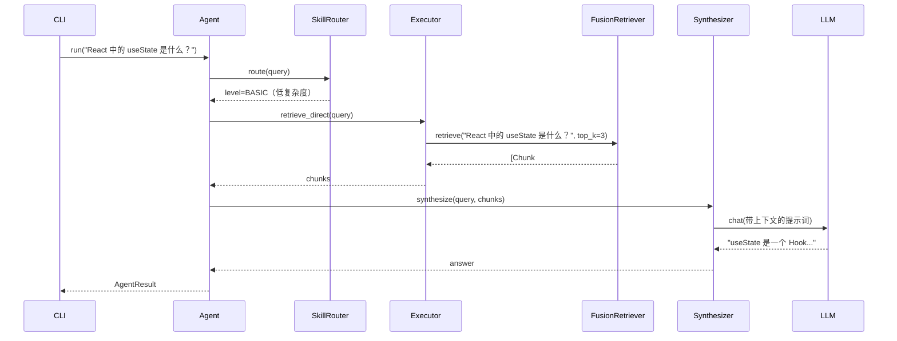

# 基本查询示例

> **命令：** `ragent query`
> **模式：** 无状态，单轮查询

---

## 1. 简单事实查询

### 输入

```bash
ragent query "React 中的 useState 是什么？"
```

### 执行流程



### 输出

```markdown
useState 是 React 的一个 Hook，用于在函数组件中添加状态。
它返回一个包含两个元素的数组：
1. 当前的状态值
2. 用于更新该状态的函数

示例：
```javascript
const [count, setCount] = useState(0);
```

来源：
- react_hooks_guide.md#1
- react_hooks_guide.md#4
```

---

## 2. 复杂比较查询

### 输入

```bash
ragent query "用代码示例比较 useState 和 useReducer"
```

### 执行流程

```mermaid
sequenceDiagram
    participant CLI
    participant Agent
    participant Planner
    participant Executor
    participant RAG
    participant Synthesizer
    participant LLM

    CLI->>Agent: run(query)
    Agent->>Agent: complexity=HIGH
    Agent->>Planner: plan(query)
    Planner->>LLM: chat(规划提示词)
    LLM-->>Planner: Plan(steps=[
      "检索 useState 文档",
      "检索 useReducer 文档",
      "比较并生成示例"
    ])
    Planner-->>Agent: Plan

    loop ReAct 执行
        Agent->>Executor: execute_step(step)
        Executor->>RAG: retrieve(step_query)
        RAG-->>Executor: chunks
        Executor->>LLM: chat(执行提示词)
        LLM-->>Executor: action
        Executor-->>Agent: observation
    end

    Agent->>Synthesizer: synthesize(plan, observations)
    Synthesizer->>LLM: chat(综合提示词)
    LLM-->>Synthesizer: final_answer
    Synthesizer-->>Agent: final_answer
    Agent-->>CLI: AgentResult
```

### 输出

```markdown
## useState vs useReducer

| 方面 | useState | useReducer |
|------|----------|------------|
| 适用场景 | 简单状态 | 复杂状态逻辑 |
| 语法 | `const [s, setS] = useState(0)` | `const [s, d] = useReducer(r, 0)` |
| 更新方式 | 直接赋值 | 通过 action 对象 |

### useState 示例
```javascript
const [count, setCount] = useState(0);
setCount(count + 1);
```

### useReducer 示例
```javascript
function reducer(state, action) {
  switch (action.type) {
    case 'increment': return state + 1;
    default: return state;
  }
}
const [count, dispatch] = useReducer(reducer, 0);
dispatch({ type: 'increment' });
```

使用建议：
- **useState**：计数器、开关、简单表单字段
- **useReducer**：复杂表单、状态机、深层嵌套更新

来源：
- react_hooks_guide.md#1 (useState)
- react_hooks_guide.md#5 (useReducer)
```

---

## 3. 错误处理示例

### 输入（API Key 无效）

```bash
ragent query "解释 useEffect"
# .env 中的 OPENAI_API_KEY 无效
```

### 输出

```
❌ 请求失败：API Key 无效。请检查 .env 配置。
   （错误码：LLM_AUTH）
```

### 使用 --verbose

```bash
ragent query "解释 useEffect" --verbose
```

```
❌ LLMAuthenticationError: Invalid API key
   错误码: LLM_AUTH
   可重试: False
   提供商: openai
   上下文: {"model": "planning-model"}
   建议: 运行 `cp .env.example .env` 并设置 OPENAI_API_KEY
```

---

## 4. JSON 输出模式

```bash
ragent query "什么是 useState？" --json
```

```json
{
  "success": true,
  "result": {
    "answer": "useState 是 React 的一个 Hook...",
    "sources": [
      {
        "source": "react_hooks_guide.md",
        "start_line": 1,
        "end_line": 10
      }
    ],
    "plan": {
      "steps_executed": 0,
      "complexity": "low"
    },
    "metadata": {
      "total_latency_ms": 1250,
      "retrieval_latency_ms": 45,
      "llm_latency_ms": 1205
    }
  }
}
```

---

## 5. 使用自定义索引

```bash
# 首先，构建索引
ragent index ./my_docs/ --output ./index/my_docs

# 使用自定义索引进行查询
ragent query "认证流程" --index ./index/my_docs
```

---

## 6. 指定技能等级查询

```bash
# 强制使用基础模式，即使查询较复杂
ragent query "生成一个登录表单" --skill-level basic

# 强制使用高级模式，获取更详细的回答
ragent query "什么是 useState？" --skill-level advanced
```

---

## 7. 禁用 RAG 的纯 LLM 查询

```bash
ragent query "写一首关于编程的诗" --no-rag
```

此模式跳过检索阶段，直接向 LLM 发送查询。适用于创意写作、开放式问题等不需要 grounding 的场景。

---

## 命令参考

```bash
ragent query [选项] <查询语句>

选项：
  --index PATH          预构建索引目录的路径
  --skill-level LEVEL   覆盖自动检测的技能等级（basic|intermediate|advanced）
  --json                输出原始 JSON 而非 Markdown
  --verbose, -v         显示调试信息和堆栈跟踪
  --no-rag              禁用检索（纯 LLM 响应）
  --top-k N             检索的分块数量（默认：5）
```
