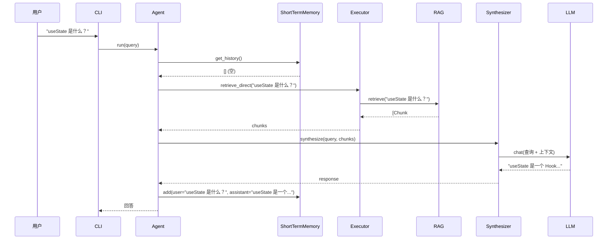
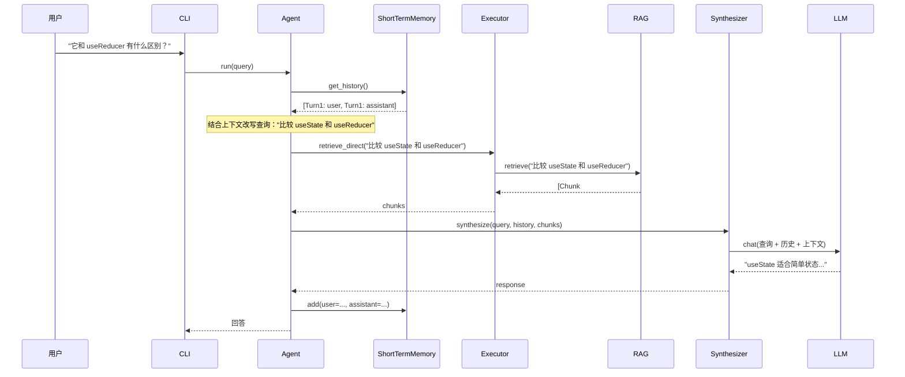
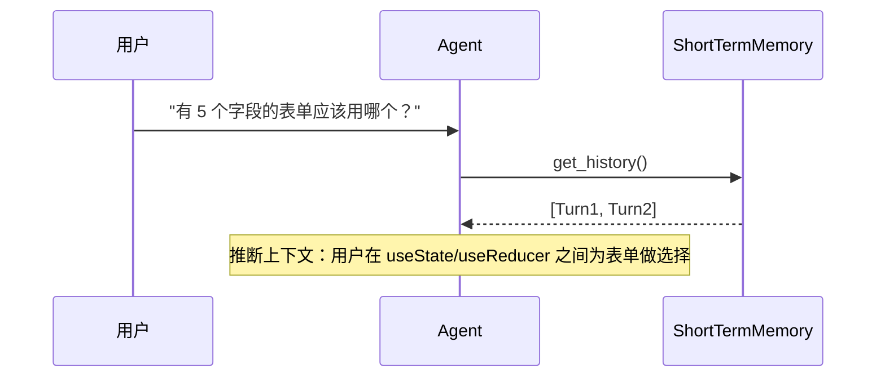

# 聊天会话示例

> **命令：** `ragent chat`
> **模式：** 交互式，带短期记忆的多轮对话

---

## 1. 启动会话

```bash
ragent chat --index ./index/react
```

### 输出

```
RAGent Chat (v0.1.0)
索引: ./index/react (已加载 1,234 个分块)
输入 'exit' 或按 Ctrl+D 退出。

> 
```

---

## 2. 多轮对话

### 第一轮

```
> useState 是什么？
```

**Agent 处理流程：**



**输出：**
```markdown
useState 是 React 的一个 Hook，用于在函数组件中添加状态。
它返回一个状态值和一个设置函数。

示例：
const [count, setCount] = useState(0);
```

---

### 第二轮（追问）

```
> 它和 useReducer 有什么区别？
```

**Agent 处理流程：**



**输出：**
```markdown
useState 最适合简单状态（计数器、开关）。
useReducer 更适合具有多个子值的复杂状态逻辑。

使用 useState 时直接更新：
  setCount(count + 1)

使用 useReducer 时通过 dispatch 触发：
  dispatch({ type: 'increment' })
```

---

### 第三轮（上下文保持）

```
> 有 5 个字段的表单应该用哪个？
```

**Agent 处理流程：**



**输出：**
```markdown
对于包含 5 个字段的表单，通常 useReducer 更清晰。
它可以将验证逻辑集中在 reducer 函数中。

示例结构：
function formReducer(state, action) {
  switch (action.type) {
    case 'update_field':
      return {...state, [action.field]: action.value};
    case 'validate':
      return {...state, errors: validate(state)};
    default:
      return state;
  }
}
```

---

## 3. 会话命令

在聊天会话中，可使用以下斜杠命令：

```
> /help              显示可用命令
> /index ./new_docs  切换到另一个索引
> /clear             清空对话历史
> /history           显示对话轮次
> /save session.json 导出对话到文件
> /exit              退出会话
```

---

## 4. 记忆行为

短期记忆采用环形缓冲区实现，默认保留最近 10 轮对话。

| 轮次 | 历史长度 | 最旧轮次 | 行为 |
|------|---------|----------|------|
| 1~10 | 1~10 | — | 全部保留 |
| 11 | 11 | Turn 1 | 全部保留（未达上限） |
| 12 | 10 | Turn 2 | Turn 1 被淘汰（FIFO） |
| 20 | 10 | Turn 10 | 持续 FIFO 淘汰 |

**注意：** 当某一轮被淘汰时，该轮检索到的上下文分块也会从工作记忆中移除。这意味着第 13 轮的 Agent 无法引用第 2 轮中检索到的文档内容，但第 2 轮的对话文本仍可能通过 LLM 的上下文窗口保留（取决于具体实现）。

---

## 5. 聊天中的错误恢复

```
> 分析这个 API：https://example.com/api
```

**场景：web_fetch 工具超时**

```
正在获取 https://example.com/api...
工具在 10 秒后超时。正在使用降级方案重试...
降级：使用 2026-05-18 的缓存快照

基于缓存快照，该 API 包含 3 个端点：
- GET /users
- POST /users
- GET /users/:id
```

---

## 6. 带系统提示词的会话

```bash
ragent chat --index ./index/react --system-prompt "你是一位资深的 React 架构师，回答应简洁专业。"
```

系统提示词会作为 `system` 角色消息注入到每轮对话的上下文中，影响 LLM 的回答风格和深度。

---

## 7. 导出和恢复会话

```bash
# 在会话中使用 /save 命令
> /save ./sessions/react_chat_20260519.json
# 已保存 15 轮到 ./sessions/react_chat_20260519.json

# 未来可通过 --load 参数恢复（v0.2 规划）
ragent chat --load ./sessions/react_chat_20260519.json
```

---

## 命令参考

```bash
ragent chat [选项]

选项：
  --index PATH          预构建索引目录的路径
  --skill-level LEVEL   覆盖自动检测的技能等级
  --json                每轮输出原始 JSON
  --verbose, -v         显示 Agent 推理步骤
  --max-turns N         最大历史长度（默认：10）
  --system-prompt TEXT  自定义系统提示词
```
