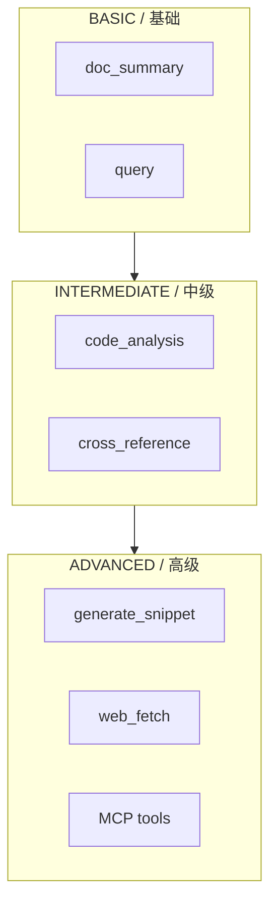
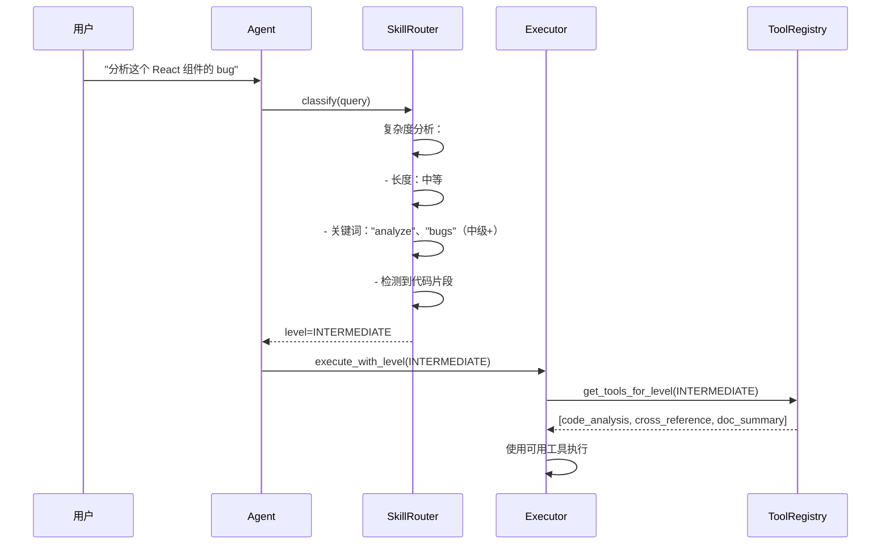

# 自定义技能示例

> **技能系统：** 基于任务复杂度的渐进式披露

---

## 1. 内置技能等级



| 等级 | 工具 | 典型查询 |
|------|------|----------|
| 基础 | doc_summary, query | "什么是 X？" |
| 中级 | 增加 code_analysis, cross_reference | "比较 X 和 Y" |
| 高级 | 增加 generate_snippet, web_fetch, MCP | "用 X 和 Y 帮我构建一个 Z" |

---

## 2. 配置技能等级

### 2.1 编程式配置

```python
from ragents.schema.skill import SkillConfig, SkillLevel

# 创建自定义技能
custom_skill = SkillConfig(
    name="frontend_review",
    level=SkillLevel.INTERMEDIATE,
    enabled=True,
    tools=["code_analysis", "cross_reference", "doc_summary"]
)
```

### 2.2 配置文件

```toml
# ragents.toml
[[skills]]
name = "frontend_review"
level = "intermediate"
enabled = true
tools = ["code_analysis", "cross_reference", "doc_summary"]

[[skills]]
name = "api_design"
level = "advanced"
enabled = true
tools = ["generate_snippet", "cross_reference", "web_fetch"]

[[skills]]
name = "basic_qa"
level = "basic"
enabled = true
tools = []  # 空列表 = 该等级下所有工具
```

### 2.3 环境变量

```bash
RAGENT_SKILL_LEVEL=intermediate
RAGENT_ENABLED_SKILLS=frontend_review,api_design
```

---

## 3. 技能路由的工作原理



### 3.1 复杂度启发式评分

| 信号 | 权重 | 示例 |
|------|------|------|
| 查询长度 > 20 词 | +1 | "用代码示例比较 useState 和 useReducer" |
| 包含比较词 | +1 | "比较"、"对比"、"vs"、"有什么区别" |
| 包含动作词 | +1 | "生成"、"构建"、"创建"、"实现" |
| 包含代码块 | +1 | ```jsx ... ``` |
| 包含 URL | +1 | "https://..." |
| 简单定义查询 | 0 | "什么是 X？" |

**阈值：**
- 得分 0~1：基础（BASIC）
- 得分 2~3：中级（INTERMEDIATE）
- 得分 4+：高级（ADVANCED）

---

## 4. CLI 覆盖示例

### 4.1 强制基础模式

```bash
ragent query "帮我生成一个登录表单" --skill-level basic
```

**结果：** Agent 只使用 `doc_summary` 和 `query`。
即使查询暗示代码生成，也不会生成代码。

```markdown
登录表单通常包含以下元素：
- 用户名/邮箱输入框
- 密码输入框
- 提交按钮
- 验证逻辑

详见 React 文档的实现说明。
```

### 4.2 强制高级模式

```bash
ragent query "什么是 useState？" --skill-level advanced
```

**结果：** Agent 可以访问所有工具，包括 `generate_snippet`。
即使是一个简单问题，也会得到附带生成示例的全面回答。

```markdown
useState 是 React 的基础状态管理 Hook。

## 实现细节

useState 通过对组件作用域变量的闭包来实现状态保持...

## 生成的示例

```jsx
function Counter() {
  const [count, setCount] = useState(0);
  return (
    <button onClick={() => setCount(c => c + 1)}>
      Count: {count}
    </button>
  );
}
```

## 源码参考

React 源码（v18.2.0）中的实际实现：
...
```

---

## 5. 创建自定义技能

### 步骤 1：定义技能

```python
# src/ragents/skills/frontend_review.py
from ragents.schema.skill import SkillConfig, SkillLevel

config = SkillConfig(
    name="frontend_review",
    level=SkillLevel.INTERMEDIATE,
    enabled=True,
    tools=[
        "code_analysis",
        "cross_reference",
        "doc_summary",
    ],
)

# 自定义路由逻辑
def should_activate(query: str) -> bool:
    keywords = ["component", "react", "jsx", "css", "bug", "performance"]
    return any(kw in query.lower() for kw in keywords)
```

### 步骤 2：注册到 SkillRouter

```python
# src/ragents/agent/skill_router.py
from ragents.skills.frontend_review import config, should_activate

class SkillRouter:
    def __init__(self):
        self.custom_skills = {
            "frontend_review": (config, should_activate),
        }

    def route(self, query: str) -> SkillLevel:
        # 优先检查自定义技能
        for name, (cfg, predicate) in self.custom_skills.items():
            if cfg.enabled and predicate(query):
                return cfg.level

        # 回退到默认启发式规则
        return self._default_classify(query)
```

### 步骤 3：添加测试

```python
# tests/unit/test_skill_router.py
from ragents.agent.skill_router import SkillRouter
from ragents.schema.skill import SkillLevel

def test_frontend_review_skill():
    router = SkillRouter()

    assert router.route("Review my React component") == SkillLevel.INTERMEDIATE
    assert router.route("Check CSS performance") == SkillLevel.INTERMEDIATE
    assert router.route("What is React?") == SkillLevel.BASIC  # 不含前端关键词

def test_custom_skill_disabled():
    router = SkillRouter()
    router.custom_skills["frontend_review"][0].enabled = False
    assert router.route("React component bug") == SkillLevel.BASIC
```

---

## 6. 技能审计日志

每次技能路由决策都会被记录，用于调试和优化：

```json
{
  "event": "skill_routing",
  "query": "构建一个数据获取的自定义 Hook",
  "detected_level": "advanced",
  "available_tools": [
    "doc_summary",
    "code_analysis",
    "cross_reference",
    "generate_snippet",
    "web_fetch"
  ],
  "complexity_score": 4,
  "signals": [
    {"type": "action_word", "word": "build", "weight": 1},
    {"type": "query_length", "words": 8, "weight": 0}
  ],
  "timestamp": "2026-05-19T11:00:00Z"
}
```

---

## 7. 动态技能切换示例

```python
from ragents.schema.skill import SkillConfig, SkillLevel
from ragents.agent.skill_router import SkillRouter

# 场景：根据用户身份动态调整技能
router = SkillRouter()

# 初级开发者 —— 限制为基础工具
junior_config = SkillConfig(
    name="junior_mode",
    level=SkillLevel.BASIC,
    enabled=True,
    tools=["doc_summary", "query"]
)

# 高级开发者 —— 开放全部工具
senior_config = SkillConfig(
    name="senior_mode",
    level=SkillLevel.ADVANCED,
    enabled=True,
    tools=[]  # 空 = 全部工具
)

# 在运行时切换
router.set_active_config(senior_config)
```

---

## 8. 最佳实践

1. **从保守开始** — 新技能应默认设为 `BASIC`，根据实际使用反馈逐步提升等级。
2. **工具重叠没关系** — 多个技能可以共享相同的工具，SkillRouter 会自动去重。
3. **显式优于隐式** — 用户始终可以用 `--skill-level` 覆盖自动检测结果。
4. **监控准确率** — 记录 `detected_level` 与用户覆盖的对比，持续调整启发式规则权重。
5. **保持向后兼容** — 修改技能配置时，保留旧配置别名至少一个次要版本周期。
6. **文档即契约** — 每个自定义技能必须在 `docs/skills/` 中提供使用文档，说明触发条件和可用工具。
