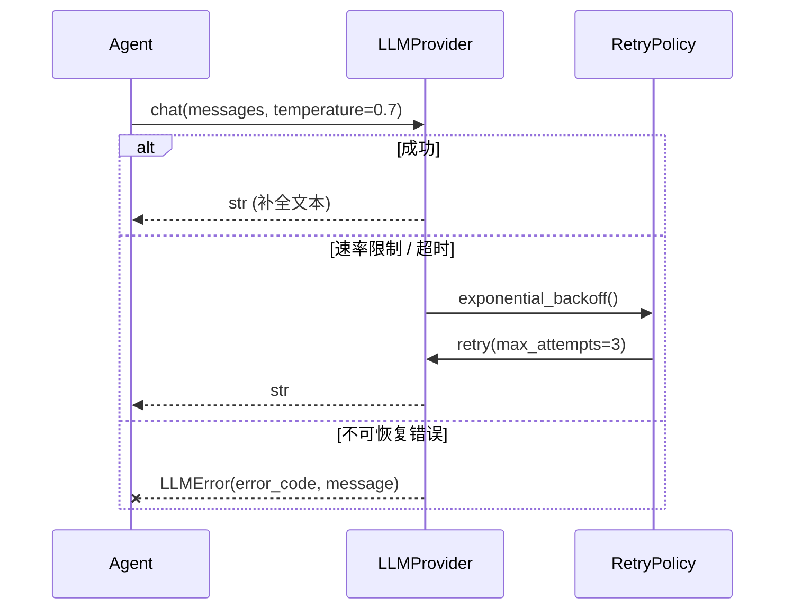
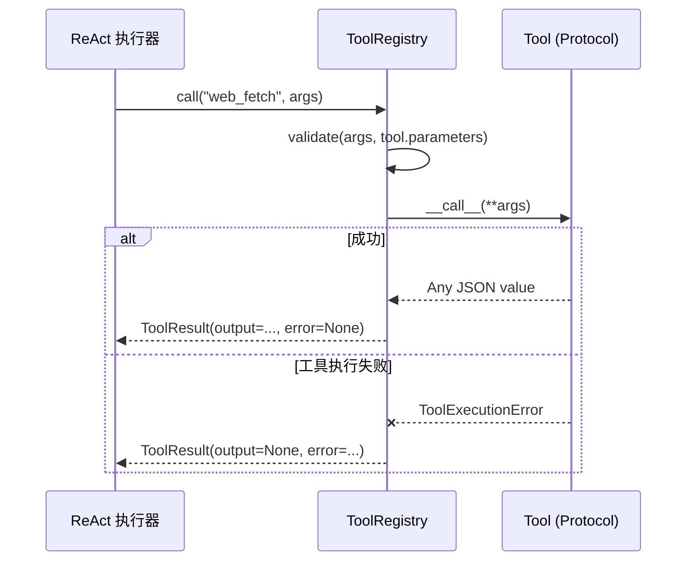
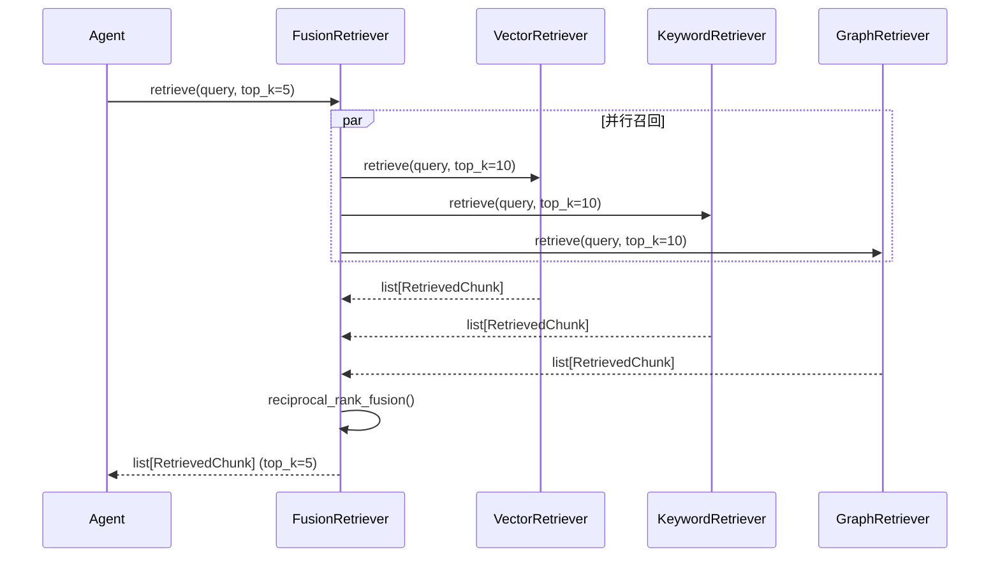
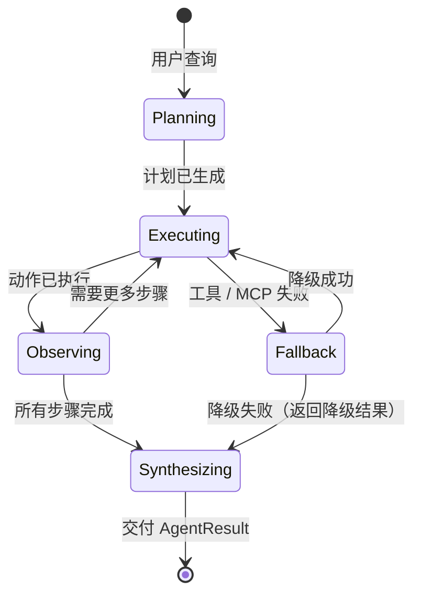

# 接口契约规范

> **版本：** 0.1.0
> **适用范围：** 覆盖 `llm`、`rag`、`tools`、`mcp`、`agent` 各层的全部公共接口。
> **格式：** 类 OpenAPI 结构化规范，含 Mermaid 序列图。

---

## 1. 设计原则

1. **显式优于隐式** — 每个方法必须声明完整签名、异常和副作用。不允许存在隐藏行为或隐式约定。
2. **在边界快速失败** — 输入校验发生在公共 API 表面；内部方法信任已类型化的输入，不做重复校验。
3. **异步就绪，同步默认** — 同步方法是 MVP 阶段的主要形式；异步变体（`a*` 前缀）作为可选扩展提供，默认通过 `asyncio.to_thread` 委托同步实现。
4. **结构化日志优于异常诊断** — 异常携带机器可读的 `error_code`；人类可读的错误消息写入结构化日志，而非仅依赖异常文本。
5. **协议优先于继承** — 工具等可扩展点采用 `Protocol` 结构子类型，降低耦合度，便于第三方扩展。

---

## 2. LLMProvider 接口（大模型提供者接口）

`LLMProvider` 是系统与大语言模型交互的唯一抽象层。所有具体 Provider（如 OpenAI、Anthropic、本地模型）必须实现此接口。

### 2.1 chat 方法

| 属性 | 值 |
|------|-----|
| **名称** | `chat` |
| **签名** | `chat(self, messages: list[dict[str, str]], *, temperature: float = 0.7, max_tokens: int \| None = None, **kwargs) -> str` |
| **描述** | 向底层大模型发送聊天补全请求，返回生成的文本内容。 |
| **参数** | |
| `messages` | 消息列表，元素格式为 `{"role": "system\|user\|assistant", "content": "..."}`。必须包含至少一条 `user` 消息。 |
| `temperature` | 采样温度，控制输出的随机性。取值范围 `[0.0, 2.0]`，`0.0` 接近确定性输出。 |
| `max_tokens` | 响应中允许的最大 token 数。`None` 表示使用 Provider 默认值。 |
| `**kwargs` | Provider 特定参数，例如 `top_p`、`presence_penalty`、`frequency_penalty` 等。 |
| **返回值** | `str` — 大模型生成的文本内容。 |
| **抛出异常** | |
| `LLMRateLimitError` | HTTP 429 或 Provider 特定的速率限制错误。**可重试。** |
| `LLMTimeoutError` | 请求套接字超时或读取超时。**可重试。** |
| `LLMAuthenticationError` | HTTP 401/403，API Key 无效或已过期。**不可重试。** |
| `LLMContentFilterError` | 内容策略违规，输入或输出被过滤。**不可重试。** |
| `LLMError` | 通用不可恢复错误，如模型不存在、服务端错误 500。**不可重试。** |

### 2.2 embed 方法

| 属性 | 值 |
|------|-----|
| **名称** | `embed` |
| **签名** | `embed(self, texts: list[str]) -> list[list[float]]` |
| **描述** | 为一批文本生成稠密向量嵌入，用于语义检索。 |
| **参数** | |
| `texts` | 非空字符串列表。最大批次大小取决于 Provider（通常 ≤ 2048）。 |
| **返回值** | `list[list[float]]` — 嵌入向量列表，每个输入文本对应一个向量。所有向量的维度必须一致。 |
| **抛出异常** | |
| `EmbeddingError` | 批次过大、内容被过滤、模型未加载或 Provider 故障。 |

### 2.3 可选异步变体

| 方法 | 签名 | 默认行为 |
|------|------|----------|
| `achat` | `async def achat(self, messages, **kwargs) -> str` | 通过 `asyncio.to_thread` 委托给 `chat`。 |
| `aembed` | `async def aembed(self, texts) -> list[list[float]]` | 通过 `asyncio.to_thread` 委托给 `embed`。 |
| `stream_chat` | `def stream_chat(self, messages, **kwargs) -> Iterator[str]` | 默认抛出 `NotImplementedError`，由具体 Provider 选择性实现。 |

---

## 3. Tool Protocol（工具协议）

工具采用**结构子类型**（`Protocol`）而非基于继承的类型体系。任何满足以下接口的可调用对象或实例均可注册到 `ToolRegistry`。

### 3.1 Tool 协议定义

| 属性 | 类型 | 必填 | 描述 |
|------|------|------|------|
| `name` | `str` | 是 | 唯一标识符。正则模式：`^[a-z_][a-z0-9_]*$`。最大 64 字符。 |
| `description` | `str` | 是 | 供 LLM 在选择工具时阅读的人类可读描述。最大 1024 字符。 |
| `parameters` | `dict` | 是（可为空） | 描述接受参数的 JSON Schema 对象。必须为标准 JSON Schema Draft 7+ 格式；无参数工具使用空对象。 |
| `skill_level` | `SkillLevel` | 否 | 默认 `SkillLevel.BASIC`。决定该工具在渐进式披露中的可见等级。 |

### 3.2 `__call__` 契约

| 属性 | 值 |
|------|-----|
| **签名** | `__call__(self, **kwargs) -> Any` |
| **前置条件** | `kwargs` 必须满足 `self.parameters` 定义的 JSON Schema。校验由 `ToolRegistry` 在调用**前**完成。 |
| **后置条件** | 成功时返回任意 JSON 可序列化值；失败时抛出 `ToolExecutionError`。 |
| **副作用** | 尽可能保持幂等。涉及网络调用的工具必须声明超时时间。涉及文件写入的工具必须声明操作范围。 |
| **抛出异常** | |
| `ToolExecutionError` | 工具执行期间的运行时失败。必须包含 `tool_name` 和 `original_error` 字段。 |
| `ToolTimeoutError` | `ToolExecutionError` 的子类。工具执行超出声明的超时时间。 |
| `ToolValidationError` | 参数未通过 JSON Schema 校验（理论上在 `ToolRegistry` 层已拦截，但工具自身可二次校验）。 |

### 3.3 ToolRegistry 调用边界

| 方法 | 签名 | 描述 |
|------|------|------|
| `register` | `register(self, tool: Tool) -> None` | 注册满足 Tool Protocol 的本地或远程工具代理。 |
| `get_tool` | `get_tool(self, name: str) -> Tool` | 返回工具定义，主要用于构建 LLM 可见的工具清单。 |
| `call` | `call(self, name: str, arguments: dict) -> ToolResult` | 校验参数、执行工具、捕获异常，并向 Agent 返回统一的 `ToolResult`。 |

`ToolRegistry.call()` 是 Agent 层唯一稳定的工具执行入口。ReAct Executor 不直接调用具体工具实例，也不依赖具体工具抛出的异常类型。

---

## 4. Retriever 接口（检索器接口）

检索器负责从索引中召回与用户查询相关的文本分块。系统支持多路检索融合。

### 4.1 BaseRetriever 基类

| 方法 | 签名 | 描述 |
|------|------|------|
| `retrieve` | `retrieve(self, query: str, top_k: int = 5) -> list[RetrievedChunk]` | 执行单次检索，返回与查询最相关的 `top_k` 个分块。 |
| `add` | `add(self, chunks: list[Chunk]) -> None` | 向索引中添加新分块。对于只读检索器，此方法可为空操作（no-op）。 |
| `batch_retrieve` | `batch_retrieve(self, queries: list[str], top_k: int = 5) -> list[list[RetrievedChunk]]` | 默认实现为循环调用 `retrieve`，子类可覆盖以利用批量优化。 |

| 抛出异常 | 触发条件 |
|----------|----------|
| `RetrievalError` | 索引损坏、查询解析失败或底层存储错误。 |
| `IndexCorruptedError` | 索引校验和（checksum）不匹配、索引文件不可读。 |
| `QueryParseError` | 查询语法错误（如图查询中的 Cypher/Gremlin 语法错误）。 |

### 4.2 具体检索器类型

| 类 | 索引类型 | `add()` 行为 | 适用场景 |
|----|---------|-------------|----------|
| `VectorRetriever` | 稠密向量存储（HNSW / FAISS） | 通过 `Embedder` 计算嵌入后插入 | 语义相似度检索 |
| `KeywordRetriever` | 倒排索引（BM25 / Trie） | 分词并更新倒排列表 | 精确匹配、前缀匹配 |
| `GraphRetriever` | 知识图谱（RDF / LPG） | 提取实体/关系，合并入图谱 | 概念遍历、关系推理 |
| `HybridRetriever` | 向量 + 关键词混合 | 分别更新两种索引 | 兼顾语义与精确匹配 |

---

## 5. Chunker 接口（分块器接口）

分块器将原始文本切分为语义连贯的检索单元。

| 方法 | 签名 | 描述 |
|------|------|------|
| `chunk` | `chunk(self, text: str, source: str) -> list[Chunk]` | 将原始文本切分为语义分块。`source` 用于标识文档来源。 |
| `chunk_file` | `chunk_file(self, path: Path) -> list[Chunk]` | 默认以 UTF-8 读取文件后委托给 `chunk`。子类可覆盖以支持二进制格式解析。 |

| 前置条件 | `text` 必须非空；`source` 必须是有效的 URI 或文件路径。 |
| 后置条件 | 返回的分块互不重叠、保持原有顺序、且覆盖完整输入文本。 |

### 5.1 分块策略

| 策略 | 类 | 触发启发式规则 |
|------|-----|----------------|
| Markdown | `MarkdownChunker` | `source.endswith('.md')` 或文本包含 `## ` 级别标题 |
| 代码 | `CodeChunker` | `source` 匹配 `*.{py,js,ts,go,rs}` 或可被 AST 解析 |
| 表格 | `TableChunker` | 文本包含 `|` 或 `<table>` 模式 |
| 语义 | `SemanticChunker` | 兜底策略；使用句子嵌入 + 断点检测识别语义边界 |
| 固定长度 | `FixedSizeChunker` | 用户显式指定；按固定字符/ token 数切分，带重叠窗口 |

---

## 6. Embedder 接口（嵌入器接口）

| 方法 | 签名 | 描述 |
|------|------|------|
| `embed` | `embed(self, texts: list[str]) -> list[list[float]]` | 批量嵌入。批次大小应在内部自动处理，对调用方透明。 |
| `embed_query` | `embed_query(self, text: str) -> list[float]` | 单查询便捷方法。默认实现为 `self.embed([text])[0]`。 |
| `dimension` | `dimension(self) -> int` | 返回固定的输出维度（如 768、1536、1024）。 |

| 抛出异常 | 触发条件 |
|----------|----------|
| `EmbeddingError` | 模型未加载、输入过长超出最大 token 限制、批次维度不匹配。 |
| `EmbeddingModelError` | 模型文件损坏或版本不兼容。 |

---

## 7. Reranker 接口（重排序器接口）

重排序器对检索器召回的候选分块进行精细化的相关性重排序，提升最终结果的准确度。

| 方法 | 签名 | 描述 |
|------|------|------|
| `rerank` | `rerank(self, query: str, chunks: list[RetrievedChunk], top_k: int \| None = None) -> list[RetrievedChunk]` | 按查询相关性对分块重新排序。`top_k` 为 `None` 时返回全部重排序结果。 |

| 前置条件 | `chunks` 可为空列表，必须优雅返回空列表，不抛出异常。 |
| 后置条件 | 输出保留所有输入分块（除非 `top_k` 限制返回数量）。各分块的 `score` 被重排序器的新分数覆盖。输出按分数降序排列。 |

---

## 8. Agent 接口（Agent 接口）

Agent 是系统的编排核心，负责查询理解、规划、执行与答案综合。

### 8.1 HybridAgent

| 方法 | 签名 | 描述 |
|------|------|------|
| `run` | `run(self, query: str, context: dict \| None = None) -> AgentResult` | 主入口方法。编排复杂度判断 → 规划器 → 执行器 → 综合器的完整流程。 |
| `plan` | `plan(self, query: str) -> Plan` | 委托给内部 `Planner` 组件生成执行计划。 |
| `execute` | `execute(self, plan: Plan, context: dict \| None = None) -> list[Observation]` | 委托给内部 `Executor` 组件执行计划中的各步骤。 |

`HybridAgent` 不直接调用具体工具、MCP Client 或检索器；这些执行期依赖属于 `Executor`。`Planner` 只依赖 LLM 和只读上下文，`Synthesizer` 只依赖 LLM、计划和观察结果。

| 上下文键 | 类型 | 描述 |
|----------|------|------|
| `history` | `list[dict]` | 聊天模式下的历史对话轮次，格式为 `{"role": "user\|assistant", "content": "..."}`。 |
| `skill_level` | `SkillLevel` | 覆盖自动检测的技能等级，强制使用指定等级的工具集。 |
| `index_path` | `str` | 预构建索引的路径，用于 RAG 检索阶段。 |
| `system_prompt` | `str` | 自定义系统提示词，覆盖默认提示词模板。 |

| 抛出异常 | 触发条件 |
|----------|----------|
| `AgentPlanningError` | 规划器在最大重试次数后仍无法生成有效计划。 |
| `AgentExecutionError` | 执行器循环超出最大步数限制（默认 10 步），或关键工具链失败且无法降级。 |
| `AgentMaxStepsError` | 执行器达到 `max_steps` 上限，计划未执行完毕。 |

---

## 9. MCP Client 接口（MCP 客户端接口）

MCP 客户端负责与外部 MCP Server 建立通信、发现工具、调用远程工具及健康监控。

| 方法 | 签名 | 描述 |
|------|------|------|
| `connect` | `connect(self) -> None` | 建立传输连接（stdio / SSE / HTTP）。必须在调用其他方法前完成。 |
| `list_tools` | `list_tools(self) -> list[Tool]` | 从服务器发现可用工具，返回工具模式（schema）列表。 |
| `call_tool` | `call_tool(self, name: str, arguments: dict) -> ToolResult` | 调用远程工具。`arguments` 必须经过 JSON Schema 校验。 |
| `health_check` | `health_check(self) -> MCPHealthStatus` | 返回缓存或新鲜的健康状态：`healthy`、`degraded`、`down` 或 `failed`。健康检查间隔由 `ServerManager` 统一管理。 |
| `disconnect` | `disconnect(self) -> None` | 优雅关闭连接，释放资源。必须确保服务器子进程被正确终止。 |

| 抛出异常 | 触发条件 |
|----------|----------|
| `MCPConnectionError` | 传输失败、stdio 管道断开或服务器进程崩溃。**可重试（3 次）。** |
| `MCPTimeoutError` | 工具调用超出配置的超时时间。**可重试（1 次）。** |
| `MCPToolNotFoundError` | 服务器响应正常，但请求的工具未知。**不可重试。** |
| `MCPProtocolError` | MCP 协议版本不匹配或消息格式错误。**不可重试。** |

---

## 10. 版本兼容性

| 版本 | 契约变更说明 |
|------|-------------|
| `0.1.x` | 初始契约。方法仅增加可选参数，不会移除已有必需参数。新增可选方法默认抛出 `NotImplementedError`。 |
| `0.2.0` | 计划将异步接口（`achat`、`aembed`）提升为一等公民，默认提供原生异步实现而非同步包装器。 |
| `1.0.0` | 计划固化所有公共接口，引入语义化版本保证。 |

---

## 附录：术语表

| 术语 | 定义 |
|------|------|
| 分块（Chunk） | 从文档中提取的语义连贯文本单元，是检索和生成的基本上下文单位。 |
| 嵌入（Embedding） | 文本在高维空间中的稠密向量表示，用于度量语义相似度。 |
| 融合（Fusion） | 将多个检索器的召回结果合并为单一排序列表的过程，通常使用 RRF 算法。 |
| 渐进式披露（Progressive Disclosure） | 仅在任务复杂度需要时才向 LLM 展示高级工具，避免简单任务过度调用复杂工具。 |
| ReAct | 推理 + 行动循环：思考（Thought）→ 行动（Action）→ 观察（Observation）。 |
| 协议（Protocol） | 结构类型接口；满足方法签名即可使用，无需显式继承。 |
| 召回（Recall） | 从索引中检索出与查询相关的候选文档/分块的过程。 |
| 重排序（Rerank） | 对召回候选进行精细化的相关性重打分和重排序。 |
