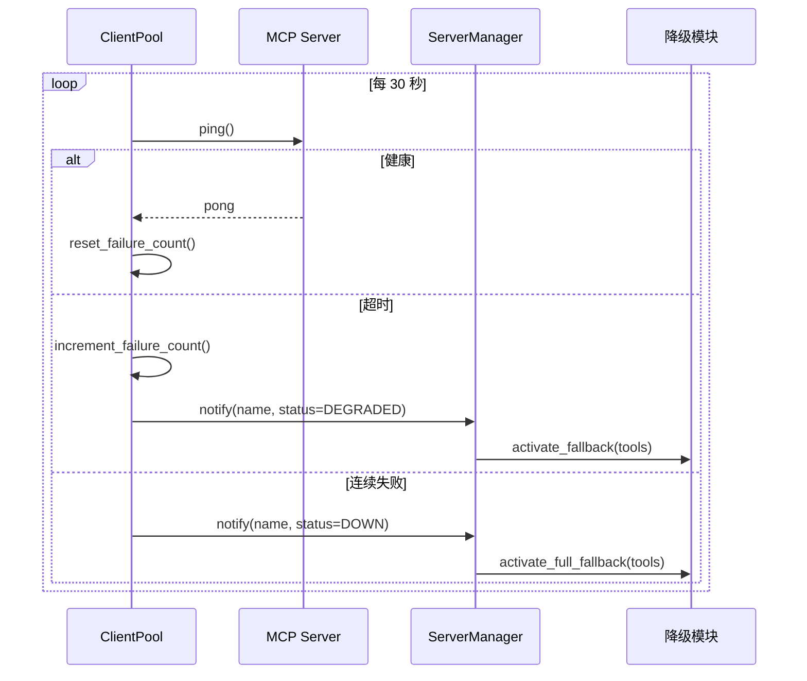
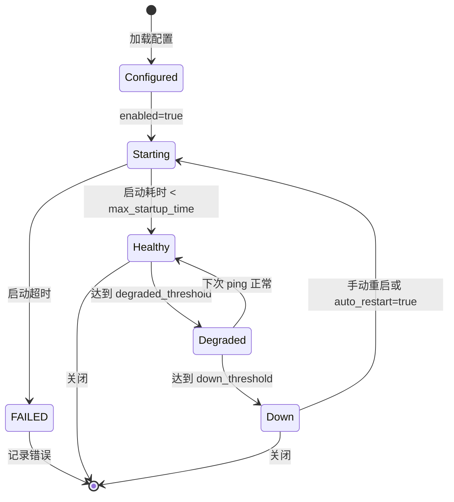
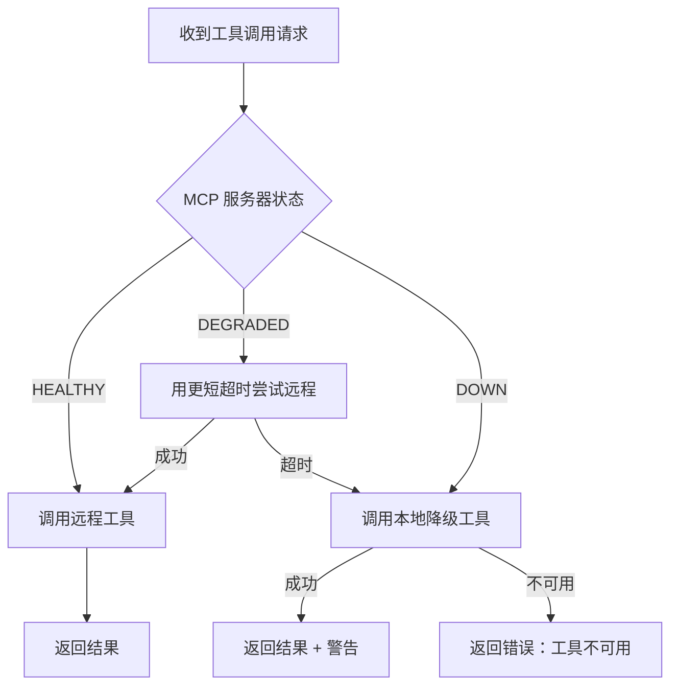

# MCP Server 安装配置指南

> **版本：** 0.1.0
> **适用范围：** MCP Server 的安装、配置、健康监控与降级行为。

---

## 1. 快速安装

运行提供的安装脚本安装常用 MCP 服务器：

```bash
./scripts/setup_mcp.sh
```

或手动安装：

```bash
# 文件系统 MCP（通过 npx）
npm install -g @modelcontextprotocol/server-filesystem

# PostgreSQL MCP（通过 uvx）
uvx mcp-server-postgres postgresql://localhost/mydb

# SQLite MCP
uvx mcp-server-sqlite --db-path ./data.db

# HTTP 请求 MCP
uvx mcp-server-fetch

# Git 仓库 MCP
uvx mcp-server-git
```

---

## 2. 配置格式

MCP 服务器支持 **TOML**、**JSON** 和**环境变量**三种配置方式。

### 2.1 TOML 配置（推荐）

在项目根目录创建或编辑 `ragents.toml`：

```toml
[mcp]
enabled = true
health_check_interval = 30.0

[[mcp.servers]]
name = "filesystem"
command = "npx"
args = ["-y", "@modelcontextprotocol/server-filesystem", "/home/user/docs"]
env = { NODE_NO_WARNINGS = "1" }
timeout = 30.0
enabled = true
fallback_tools = ["doc_summary", "web_fetch"]

[[mcp.servers]]
name = "postgres"
command = "uvx"
args = ["mcp-server-postgres", "postgresql://localhost:5432/mydb"]
timeout = 60.0
enabled = true
fallback_tools = []

[[mcp.servers]]
name = "sqlite"
command = "uvx"
args = ["mcp-server-sqlite", "--db-path", "./data.db"]
timeout = 10.0
enabled = false  # 默认禁用
```

### 2.2 JSON 配置（备选）

```json
{
  "mcp": {
    "enabled": true,
    "servers": [
      {
        "name": "filesystem",
        "command": "npx",
        "args": ["-y", "@modelcontextprotocol/server-filesystem", "/home/user/docs"],
        "timeout": 30.0,
        "enabled": true,
        "fallback_tools": ["doc_summary"]
      }
    ]
  }
}
```

### 2.3 环境变量

对于简单场景，使用 `.env`：

```bash
# MCP 文件系统服务器
MCP_FILESYSTEM_COMMAND=npx
MCP_FILESYSTEM_ARGS=-y,@modelcontextprotocol/server-filesystem,/home/user/docs
MCP_FILESYSTEM_ENABLED=true
MCP_FILESYSTEM_TIMEOUT=30

# MCP PostgreSQL 服务器
MCP_POSTGRES_COMMAND=uvx
MCP_POSTGRES_ARGS=mcp-server-postgres,postgresql://localhost/mydb
MCP_POSTGRES_ENABLED=true
```

---

## 3. 配置模式

### 3.1 MCPServerConfig 字段

| 字段 | 类型 | 必填 | 默认值 | 描述 |
|------|------|------|--------|------|
| `name` | `str` | 是 | — | 唯一标识符。正则：`^[a-z0-9_-]+$` |
| `command` | `str` | 是 | — | 可执行文件名或绝对路径 |
| `args` | `list[str]` | 否 | `[]` | 命令行参数 |
| `env` | `dict` | 否 | `{}` | 环境变量覆盖 |
| `enabled` | `bool` | 否 | `true` | Agent 初始化时是否自动启动 |
| `timeout` | `float` | 否 | `30.0` | 工具调用超时（秒） |
| `fallback_tools` | `list[str]` | 否 | `[]` | 服务器宕机时激活的本地工具名 |
| `max_startup_time` | `float` | 否 | `10.0` | 等待进程启动的最大秒数 |

### 3.2 全局 MCP 设置

```toml
[mcp]
enabled = true                    # 总开关
health_check_interval = 30.0      # 健康检查间隔
connection_timeout = 5.0          # TCP/stdio 连接超时
degraded_threshold = 2            # 标记为 DEGRADED 前的连续失败次数
down_threshold = 5                # 标记为 DOWN 前的连续失败次数
auto_restart = false              # 是否自动重启 DOWN 状态的服务器
```

---

## 4. 健康检查

### 4.1 健康检查流程



### 4.2 健康状态转换



### 4.3 CLI 健康命令

```bash
# 检查所有服务器
ragent mcp list

# 预期输出：
# NAME        STATUS     HEALTHY_SINCE    TOOLS
# filesystem  healthy    2m ago           read_file, list_directory
# postgres    degraded   —                — (fallback active)
# sqlite      down       —                — (fallback active)

# 测试特定服务器
ragent mcp test filesystem
# ✓ filesystem: healthy (3 tools available)

# 重启服务器
ragent mcp restart postgres
# Restarting postgres... ✓ Healthy
```

---

## 5. 降级行为

### 5.1 降级触发条件

| 服务器状态 | 触发条件 | 操作 |
|-----------|---------|------|
| `DEGRADED` | 连续失败达到 `degraded_threshold`，但尚未达到 `down_threshold` | 标记工具为缓慢；排队重新健康检查 |
| `DOWN` | 连续失败达到 `down_threshold` | 注销远程工具；注册本地降级工具 |
| `FAILED` | 进程启动错误或配置校验失败 | 立即降级；不重试，等待用户修复配置 |

### 5.2 降级解析流程



### 5.3 降级配置示例

```toml
# 示例：文件系统 MCP，配置完整的本地降级
[[mcp.servers]]
name = "filesystem"
command = "npx"
args = ["-y", "@modelcontextprotocol/server-filesystem", "/docs"]
fallback_tools = ["doc_summary", "web_fetch"]
# 当 filesystem MCP 不可用时：
# - read_file → 降级到 doc_summary（部分降级：仅限缓存文档）
# - list_directory → 无降级（返回错误）

# 示例：PostgreSQL MCP，无降级
[[mcp.servers]]
name = "postgres"
command = "uvx"
args = ["mcp-server-postgres", "postgresql://localhost/db"]
fallback_tools = []
# 当 postgres 不可用时：需要数据库的查询立即失败
# 这是有意的设计 —— 陈旧数据比没有数据更糟
```

### 5.4 运行时降级日志

降级激活时，系统记录以下结构化日志：

```json
{
  "event": "mcp_fallback_activated",
  "server": "filesystem",
  "previous_status": "healthy",
  "new_status": "down",
  "fallback_tools": ["doc_summary", "web_fetch"],
  "affected_tools": ["read_file", "list_directory"],
  "timestamp": "2026-05-19T10:30:00Z"
}
```

---

## 6. 故障排查

### 6.1 服务器无法启动

```bash
# 检查命令是否存在
which npx
which uvx

# 手动测试命令
npx -y @modelcontextprotocol/server-filesystem /home/user/docs

# 查看详细日志
ragent mcp test filesystem --verbose
```

### 6.2 连接超时

| 原因 | 解决方案 |
|------|----------|
| 防火墙阻断 stdio/SSE | 检查 `localhost` 规则；使用 `--transport stdio` |
| 工具执行缓慢 | 在配置中增大 `timeout` |
| 资源耗尽 | 减少并发 MCP 服务器数量 |
| 网络不可达 | 检查 DNS 和代理配置 |

### 6.3 工具发现失败

```bash
# 强制重新发现
ragent mcp refresh filesystem

# 列出已发现的工具
ragent mcp tools filesystem

# 检查服务器标准输出
ragent mcp logs filesystem --tail 50
```

---

## 7. 安全考量

1. **命令注入** — 永远不要将用户输入插值到 `command` 或 `args` 中。所有命令参数应在配置时静态确定。
2. **环境变量泄漏** — 包含 MCP 密钥的 `.env` 文件必须在 `.gitignore` 中。
3. **范围限制** — 文件系统 MCP 只应访问指定的目录，不得访问系统敏感路径。
4. **超时设置** — 始终设置 `timeout`，防止进程无限挂起导致资源泄漏。
5. **权限最小化** — MCP Server 应以最小权限运行，避免使用 root 或管理员账户。

---

## 8. 支持的 MCP Server

| 服务器 | 安装命令 | 用途 |
|--------|----------|------|
| filesystem | `npx -y @modelcontextprotocol/server-filesystem` | 读写本地文件 |
| postgres | `uvx mcp-server-postgres <conn>` | SQL 数据库查询 |
| sqlite | `uvx mcp-server-sqlite --db-path <file>` | 轻量级 SQL |
| fetch | `uvx mcp-server-fetch` | HTTP 请求（比原始 `web_fetch` 更安全） |
| git | `uvx mcp-server-git` | 仓库操作 |
| brave-search | `uvx mcp-server-brave-search` | 网络搜索 |
| github | `uvx mcp-server-github` | GitHub API 操作 |

---

## 附录：配置校验

RAGent 在启动时校验 MCP 配置。常见错误及修复：

```
错误：MCP server 'filesystem' 的命令 'npx' 在 PATH 中未找到
修复：安装 Node.js 或使用 npx 的绝对路径

错误：MCP server 'postgres' 的 fallback_tools 包含未知工具 'db_query'
修复：将 'db_query' 添加到 tools/registry.py，或从 fallback_tools 中移除

错误：MCP server 'sqlite' 的 timeout (600.0) 超出全局最大值 (300.0)
修复：减小 timeout，或在 [mcp] 段中增大全局上限

错误：MCP server 'filesystem' 的 args 包含不存在的路径 '/missing'
修复：确保路径存在且 RAGent 进程有读取权限
```
